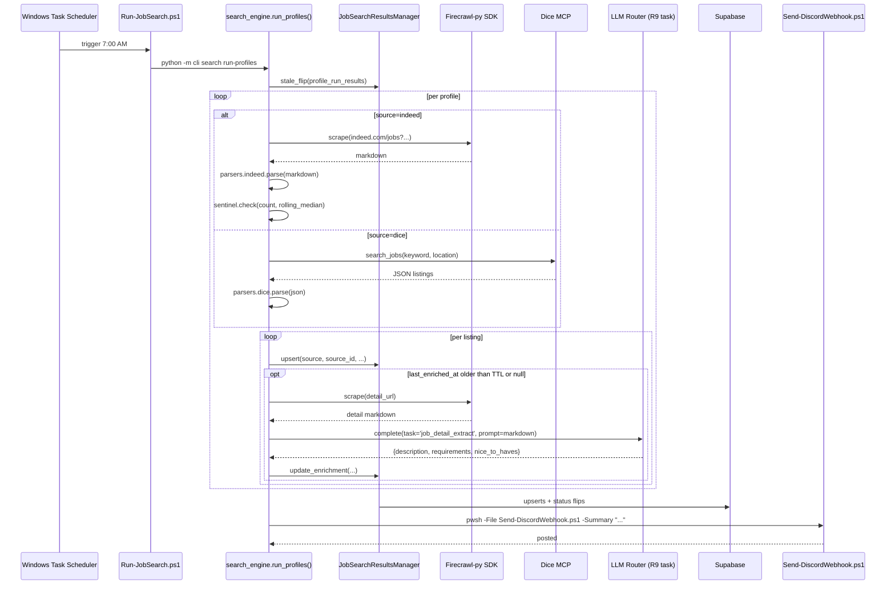

# CareerPilot Job Search v1 — CLI Engine + Dashboard Reader

## Overview

Invert the architecture of CareerPilot's job-search features so the workstation CLI is the search engine and the Vercel-deployed dashboard is a reader, with Supabase as the only seam. Replace the current Anthropic Haiku + `web_search` Indeed path with Firecrawl scraping + local Qwen structured extraction. Make the existing `search_profiles` Supabase table canonical. Add an engagement surface (nav badge + Discord daily summary) so a scheduled-but-unsynchronous v1 still gets the user's attention.

The plan covers eight implementation units, sequenced to land foundation (migrations, parsers) before engine (CLI command + manager + enrichment) before dashboard (badge + page repoint) before cutover (decommission + scheduled task).

## Validation Log

- **2026-04-27 — Indeed Firecrawl validation: FAILED.** Three Firecrawl scrape attempts against `indeed.com/jobs?q=…&l=…` (with and without `--wait-for 5000-8000`, `--country US`, `--only-main-content`, alternate URL formats) all returned 54-byte CAPTCHA placeholder bodies. Indeed bot-detection blocks Firecrawl from this account. **Outcome:** Outstanding Questions branch (b) triggered — Indeed scope punted to v2 ([CAR-189](https://jlfowler1084.atlassian.net/browse/CAR-189)). v1 ships **Dice-only**. R2's `JobSearcher.search_indeed` stays a stub; the parser sentinel still applies (now to Dice-only); SC2's screenshot-symptom criterion drops the Indeed clause; SC3's gate of "≥ 20 Dice rows" is the success bar. The Indeed parser planned in Unit 3 is no longer in v1 scope.
- **2026-04-27 — Unit 1 landed.** Migrations applied; dashboard reconciled; tsc + vitest green. See PR #38.

## Problem Frame

CareerPilot's exploratory search features today are simultaneously expensive (~$0.10-0.30/call to Anthropic) and low-quality (empty Indeed detail panels, no clickable apply links — see the user's screenshot). The user reports CareerPilot is genuinely most useful as a tracker for applications they already have leads on; exploratory search is poor enough that they avoid it. v1 fixes both the cost and rendering problems by inverting the architecture: workstation CLI does the work (Firecrawl + local Qwen), Supabase stores the artifacts, dashboard reads them.

This is option C ("move-flow-to-CLI") from CAR-142 Phase 2 deferred decisions, refined into a concrete shape — same pattern already proven by `careerpilot-research` (CAR-183), but with Supabase as the artifact store instead of markdown files.

## Requirements Trace

(see origin: `docs/brainstorms/2026-04-27-careerpilot-job-search-cli-v1-requirements.md`)

- **R1-R6 (Engine + Sources):** Python CLI engine; Firecrawl for Indeed; existing Dice MCP path; parser-based listing extraction (no LLM); Supabase `search_profiles` canonical; optional skill wrapper.
- **R7-R10 (Storage + Dedup):** New `job_search_results` table; composite uniqueness on `(user_id, source, source_id)`; RLS via service-role + explicit `user_id` stamping; stale auto-detection gated on successful runs.
- **R11-R14 (Enrichment):** Eager per-job-detail enrichment on the workstation; Firecrawl + local Qwen R9 task; inline columns on `job_search_results`; no auto-trigger of `careerpilot-research`.
- **R15-R18 (Dashboard):** Search Results view; clickable apply link; Track creates application + flips status + routes to Research tab; decommission existing Vercel search routes.
- **R19-R20 (Preserved):** `extract-job/route.ts` paste-URL flow unchanged; `JobSearcher.search_indeed` stub replaced by Firecrawl path.
- **R21-R22 (Engagement):** Nav badge for `status='new'` rows; daily Discord summary via the global `discord-webhook` skill.

**Success criteria** (from origin):
1. Zero Anthropic API calls in any search-related flow on the dashboard.
2. Screenshot symptom (empty Indeed detail) is gone.
3. Scheduled invocation runs ≤ 5 min, **gate** ≥ 20 Dice rows / **target** ≥ 30 total rows.
4. Track lands user on the new application's Research tab without extra navigation.
5. Daily Firecrawl credit ceiling ~130 credits.
6. Engagement surface works (badge + Discord push).

## Scope Boundaries

- No LinkedIn job-listing scraping (v2 — auth/cookies validation spike).
- No dashboard "Run now" sync triggers (v2 — needs polling watcher or Supabase realtime).
- No relevance ranker using local Qwen + resume context (v2 — gated on engagement-surface outcome).
- No auto-trigger of `careerpilot-research` from search results (v2).
- No replacement of paste-URL `extract-job/route.ts` (separate-architecture flow on purpose).
- No multi-user / shared search-queue workflows (out of scope entirely, not v2).

### Deferred to Separate Tasks

- **v2 tracking ticket** (to be created during Phase 5 handoff): LinkedIn scraping, Run-now triggers, profile CRUD UX polish, polling watcher, auto-research, paste-URL cost trim, resume-context relevance scorer.
- **Optional skill wrapper `/careerpilot-job-search`** (R6) — defer to a follow-up ticket if planning execution time runs short. Engine is callable from a Claude Code session via `python -m cli search run-profiles` regardless.

## Context & Research

### Relevant Code and Patterns

**CLI architecture (`cli.py`, single 5,800-line Click app):**
- Existing flat `@cli.command() search` at `cli.py:937` — converts to `@cli.group()` in Unit 4.
- `@cli.group()` precedents already exist (`tracker`, `contacts`, `agencies`).

**Supabase Python client + manager pattern:**
- `src/db/supabase_client.py` — service-role singleton, raises `SupabaseNotConfiguredError` if env vars missing.
- `src/jobs/tracker.py:68-85` — canonical `Manager(client=None, user_id=None)` shape with `CAREERPILOT_USER_ID` enforcement (raises `ApplicationTrackerNotConfiguredError` to prevent orphan rows). Every read/write chains `.eq("user_id", self._user_id)`.
- `tests/conftest.py` — `FakeSupabaseClient` fixture; emulates the postgrest builder chain. **Does not currently support `.upsert()`** — Unit 4 extends.

**Local LLM router (CAR-142):**
- `src/llm/router.py` module-level singleton; callers do `from src.llm.router import router; router.complete(task=..., prompt=...)`.
- `config/settings.py::TASK_MODEL_MAP` (line 93) routes by task name. R9 = local; R10 = Claude.
- `config/settings.py::TASK_CONFIG` (line 126) defines per-task system prompt + schema + max_tokens. `skill_extract` (lines 192-232) is the closest precedent for "structured extraction from text."
- **Qwen reasoning-parser gotcha:** `extra_body={"chat_template_kwargs": {"enable_thinking": False}}` — bake in from the first call site (per `MEMORY.md::qwen3-extra-body-gate.md`).

**Supabase migrations:**
- Migrations live at `dashboard/supabase/migrations/<timestamp>_<slug>.sql`.
- Application path: Supabase MCP `apply_migration` against the live project (CAR-163 / CAR-168 pattern). The SQL file is committed to history.
- After migration: `cd dashboard && npm run types:generate` to regenerate TypeScript types in `dashboard/src/types/database.types.ts`.
- **RLS pattern:** `USING (user_id = (SELECT auth.uid()))` — the `(SELECT …)` form is up to 100× faster on hot reads than bare `auth.uid()` (per INFRA-90 review). Always index `user_id`.

**Dashboard nav badge:**
- `dashboard/src/components/layout/sidebar.tsx:25-83` — two existing badges (`useActiveAppCount`, `useApprovedQueueCount`) using Supabase realtime `postgres_changes` subscriptions for live updates.
- New badge for `job_search_results.status='new'` copies `useApprovedQueueCount` verbatim.
- Existing nav slot at `sidebar.tsx:13` (`{ id: "search", … }`) gets repointed and badged in Unit 7.

**Existing parsers (TypeScript):**
- `dashboard/src/lib/parsers/{indeed,dice}.ts` plus tests at `dashboard/src/__tests__/lib/parsers/`. Port to Python in Unit 3 to avoid cross-language drift.

**Scheduled-task precedent:**
- `scripts/Register-ScanTask.ps1` registers `CareerPilot-MorningScan` daily; the runner is `Run-MorningScan.ps1` (a thin "log + exit-code propagate" shell). Unit 8 either replaces this with a job-search task or piggybacks on it.

**Discord webhook:**
- Global skill at `~/.claude/skills/discord-webhook/SKILL.md` wraps `F:\Projects\ClaudeInfra\tools\Send-DiscordWebhook.ps1`. v1 invokes it via `subprocess.run(["pwsh", "-NoProfile", "-File", ...])` from the engine.

### Institutional Learnings

- **`docs/plans/2026-04-21-001-CAR-168-contacts-supabase-port-plan.md`** — canonical "port a CLI table to Supabase" recipe. Manager skeleton, FakeSupabaseClient extensions, `--dry-run` / `--finalize --yes` migration script gates. Unit 2 mirrors this shape.
- **`docs/reviews/INFRA-90-code-review.md` Findings 15-17** — the `USING (user_id = (SELECT auth.uid()))` RLS form. Always index `user_id`.
- **`docs/brainstorms/CAR-163-application-entry-paths-consolidation-audit.md`** — Option-C decision criteria for "Supabase vs local SQLite." `job_search_results` clearly belongs in Supabase (dashboard reads it).
- **`F:\Projects\ClaudeInfra\docs\solutions\reasoning-parser-enable_thinking-false.md`** — Qwen reasoning-parser eats `max_tokens` budget; fix via `extra_body`. Bake into the first enrichment call.
- **`F:\Obsidian\SecondBrain\docs\solutions\2026-04-22-cross-project-bridge-design-lessons.md`** (SB-48) — Lesson 5: patterns vs. mechanics; for v1, Supabase as a single shared queue *is* the mechanic, no extra transport needed. Lesson 2: classify input/output coupling before scoping retries.
- **`docs/solutions/workflow-issues/transcripts-kind-consolidation-2026-04-15.md` §1-2** — idempotent migration patterns (natural-key dedup, audit columns). Apply via Supabase `.upsert(…, on_conflict=…)`.
- **No prior CareerPilot solution doc** for Indeed scraping / bot-detection, Discord daily-summary patterns, or eager-vs-lazy enrichment trade-offs. Compound after v1 ships.

### External References

- Skipped — repo has strong patterns for Supabase, LLM router, and nav-badge UI. The two thin areas (Firecrawl Python SDK choice, pwsh-from-Python Discord call) are small reversible decisions made above.

## Key Technical Decisions

- **Firecrawl integration uses `firecrawl-py` SDK** added to `requirements.txt`. Subprocess CLI works for Bash-based skills (`careerpilot-research`) but a long-running, scheduled Python engine benefits from native error types and async-friendly invocation. *Reversible if SDK reliability disappoints.*
- **Discord webhook calls go through the existing pwsh wrapper** (`F:\Projects\ClaudeInfra\tools\Send-DiscordWebhook.ps1`) via `subprocess.run`. Centralizes channel routing and matches the existing scheduled-task pattern. *Alternative considered:* direct `requests` POST with a new env var — rejected to avoid duplicating the channel-routing logic.
- **CLI command shape: convert flat `@cli.command() search` → `@cli.group() search` with `run-profiles` and `interactive` subcommands.** Keeps the existing morning-scan task hook intact (it currently calls `python -m cli search`; will become `python -m cli search interactive` for the legacy interactive flow, and the new `run-profiles` for scheduled invocation). *Alternative considered:* sibling top-level group (`jobsearch`) — rejected because two top-level commands for the same domain bloats the help.
- **Stale-flip is a step at the start of `run-profiles`**, not a Postgres trigger or Supabase scheduled function. Matches the "pure Python CLI engine" architecture; one place to gate on "this profile ran successfully," easy to test.
- **Dice details use the existing MCP `summary` field for `description` in v1** (no per-result Firecrawl scrape on dice.com). Saves ~80 credits/day. Adds a config flag (`CAREERPILOT_DICE_FULL_SCRAPE=1`) to opt into per-result scraping later if quality is insufficient. *Decision rationale:* the existing `dashboard/src/app/api/job-details/route.ts::buildDiceDetails` already proves the summary field is meaningfully populated for tracked-application UX.
- **Enrichment TTL = 14 days, matching the stale-flip window.** A row whose `last_enriched_at` is older than 14 days gets re-enriched on the next scheduled run. Single TTL number, not per-source.
- **Parsers ported to Python** under `src/jobs/parsers/` — not invoked via Node subprocess. Avoids cross-language drift; keeps the engine pytest-coverable.
- **Reuse the existing `/search` nav slot** rather than introducing a parallel "Search Results" entry. The page contents change; the nav stays. Per repo research, this is the cleaner shape than menu bloat.
- **Decommission of old Vercel search routes is the LAST step**, after the new pipeline produces ≥1 successful run, to avoid a window where neither the old nor the new path works.
- **Unit 6 is the "robustness" unit** that bundles parser sentinel, stale-flip gate, run-summary log, and Discord daily summary because they all consume the same per-profile run-result data structure. Splitting them would force three units to invent the same shape.

## Open Questions

### Resolved During Planning

- **Lazy vs. eager enrichment ownership** — Resolved in brainstorm: eager on workstation. (No Vercel→Anthropic seam; full data on first dashboard open.)
- **Profile source-of-truth (3 candidates)** — Resolved in brainstorm: Supabase `search_profiles` canonical. Migration in Unit 2.
- **Cache shape (separate `job_details_cache` table vs inline columns)** — Resolved: inline columns on `job_search_results` (per R7 schema).
- **Indeed bot-detection contingency framing** — Resolved: parser sentinel + stale-flip gate + Dice-only floor (Units 3 + 6).
- **CLI command shape** — Resolved above (Key Technical Decisions): convert flat to group.
- **Firecrawl Python integration path** — Resolved: `firecrawl-py` SDK.
- **Discord webhook path** — Resolved: pwsh wrapper subprocess.
- **Search Results view shape (top-level vs. filter on grid)** — Resolved: reuse existing `/search` slot.
- **Stale-flip placement** — Resolved: step at start of `run-profiles`.
- **Dice detail data sufficiency** — Resolved: MCP `summary` field; config flag for opt-in scrape later.
- **Enrichment TTL** — Resolved: 14 days.
- **Parser language** — Resolved: port to Python.
- **Track-on-already-tracked behavior (DL-03 from doc review)** — Resolved: button is enabled but routes to the existing application's Research tab (no duplicate created); the search result row's `application_id` back-fills if missing.

### Deferred to Implementation

- **Exact `firecrawl-py` SDK version pin** — depends on what's current at install time. Pin to the version that ships when implementation begins.
- **Final SQL details after touching real Postgres** — column types, constraint names, partial-index decisions. The migration files are produced under Supabase MCP review.
- **Indeed search URL parameter shape** — `q=` vs `keyword=`, location encoding, contract filter param. Confirmed in the first 30 minutes of implementation against a live Firecrawl scrape.
- **Per-profile listing-page count** — most profiles return all useful results on page 1, but Firecrawl quota math depends on the actual paging behavior. Confirmed during implementation; if pagination is needed, the budget rises ~3-4× and SC5 is revisited.
- **TypeScript parser deletion vs deprecation** — `dashboard/src/lib/parsers/{indeed,dice}.ts` may have non-search consumers. Implementation grep first; if no consumers, delete; if any, leave with a deprecation note.
- **`useApprovedQueueCount`-vs-direct-count for the new badge** — depends on whether realtime `postgres_changes` is preferred over a refresh-on-mount pattern for `status='new'` (which can change from CLI side). Implementation picks; recommendation is to mirror `useApprovedQueueCount` exactly.
- **Discord summary message formatting details** — embed colors, exact field labels, total-line vs per-profile-line ordering. Implementation chooses based on what looks readable in the actual Discord client.

## Output Structure

```
src/jobs/
├── parsers/
│   ├── __init__.py
│   ├── indeed.py            # Indeed Firecrawl markdown parser (NEW)
│   ├── dice.py              # Dice MCP JSON parser (NEW — port of TS)
│   └── sentinel.py          # Parser-sentinel rolling-median check (NEW)
├── job_search_results.py    # JobSearchResultsManager (NEW — ApplicationTracker shape)
├── enrichment.py            # Eager per-job-detail enrichment (NEW)
├── searcher.py              # MODIFY: Indeed Firecrawl path; Dice unchanged
└── search_engine.py         # NEW: top-level orchestrator for run-profiles

dashboard/supabase/migrations/
├── <timestamp>_car_xxx_create_job_search_results.sql       # NEW
└── <timestamp>_car_xxx_reshape_search_profiles.sql         # NEW

scripts/
├── migrate_search_profiles_to_supabase.py    # NEW (one-time)
└── Run-JobSearch.ps1                          # NEW (scheduled-task wrapper)

tests/
├── test_indeed_parser.py             # NEW
├── test_dice_parser.py                # NEW
├── test_sentinel.py                   # NEW
├── test_job_search_results.py         # NEW
├── test_enrichment.py                 # NEW
├── test_search_engine.py              # NEW
└── conftest.py                        # MODIFY: extend FakeSupabaseClient.upsert()

dashboard/src/
├── app/(main)/search/page.tsx         # MODIFY: read from job_search_results
├── components/layout/sidebar.tsx      # MODIFY: add Job Search badge
├── hooks/use-search-results.ts        # NEW
├── components/search/result-row.tsx   # NEW (or modify existing)
└── components/search/detail-panel.tsx # NEW (or modify existing)
```

## High-Level Technical Design

> *This illustrates the intended approach and is directional guidance for review, not implementation specification. The implementing agent should treat it as context, not code to reproduce.*

### Run-profiles flow (the scheduled invocation)



### Parser sentinel logic (Unit 6)

> *Pseudo-code; communicates the gate, not the exact implementation.*

```
def is_degraded(profile_id, current_count) -> bool:
    median = rolling_median_count(profile_id, days=7)
    if median < 4:
        return False  # not enough history to gate
    return current_count < (0.5 * median)
```

Profiles flagged degraded:
- Skip stale-flip for that profile this run (R10 gate).
- Log warning with profile_id, current count, median, and a sample of the parsed-or-empty markdown for diagnosis.
- Discord summary notes "{profile_label}: degraded (got {N}, expected ~{median})".
- Run does not fail; the row write loop continues.

## Implementation Units

- [ ] **Unit 1: Supabase migrations — `job_search_results` table + `search_profiles` reshape**

**Goal:** Produce the two migration SQL files, apply them via Supabase MCP `apply_migration`, regenerate TypeScript types. Schema reflects R7 + R5 reshape decisions.

**Requirements:** R5, R7, R8, R9.

**Dependencies:** None (foundation unit).

**Files:**
- Create: `dashboard/supabase/migrations/<timestamp>_car_xxx_create_job_search_results.sql`
- Create: `dashboard/supabase/migrations/<timestamp>_car_xxx_reshape_search_profiles.sql`
- Modify: `dashboard/src/types/database.types.ts` (regenerated, not hand-edited)

**Approach:**
- `job_search_results` columns per R7: `id`, `user_id`, `source` (`'indeed' | 'dice'`), `source_id` (text), `url`, `title`, `company`, `location`, `salary`, `job_type`, `posted_date`, `easy_apply`, `profile_id`, `profile_label`, `description` (text, nullable), `requirements` (jsonb, nullable), `nice_to_haves` (jsonb, nullable), `discovered_at`, `last_seen_at`, `last_enriched_at` (nullable), `status` (text, check-constrained to the 5 values), `application_id` (FK).
- Composite unique index on `(user_id, source, source_id)`.
- Performance index on `(user_id, last_seen_at DESC)` for the dashboard's primary query.
- RLS enabled with `FOR ALL USING (user_id = (SELECT auth.uid())) WITH CHECK (user_id = (SELECT auth.uid()))` — the `SELECT` form per INFRA-90 finding.
- `search_profiles` reshape: drop `'both'` and `'dice_contract'` from the source enum; add `contract_only BOOLEAN DEFAULT FALSE`; backfill existing rows: where source was `'dice_contract'`, set source = `'dice'` and `contract_only = TRUE`.
- Both migrations use `IF NOT EXISTS` / `IF EXISTS` guards for idempotency.

**Patterns to follow:**
- `dashboard/supabase/migrations/20260414164841_add_contacts.sql` (table + RLS pattern).
- `dashboard/supabase/migrations/20260421140000_car_165_add_cli_columns.sql` (idempotent ALTERs).

**Test scenarios:**
- *Test expectation: integration verification only — no unit tests for SQL.* Apply via Supabase MCP `apply_migration`; verify with: (a) `select * from public.job_search_results limit 1` returns no error; (b) `\d+ job_search_results` shows the unique constraint and indices; (c) RLS denies a fake-uid select; (d) `search_profiles` rows previously sourced `'dice_contract'` now have `source='dice', contract_only=true`.

**Verification:**
- Both migrations applied to live Supabase.
- `npm run types:generate` regenerates `database.types.ts` with the new table.
- TypeScript `npm run build` in `dashboard/` succeeds (no type errors against the new schema).

---

- [ ] **Unit 2: One-time data migration — seed `search_profiles` from `config/search_profiles.py`**

**Goal:** Migrate the 8 Dice profiles from the Python file into the reshaped Supabase `search_profiles` table. After this unit, the Python `SEARCH_PROFILES` dict is no longer the runtime source.

**Requirements:** R5.

**Dependencies:** Unit 1 (table reshape complete).

**Files:**
- Create: `scripts/migrate_search_profiles_to_supabase.py`
- Modify: `dashboard/src/lib/constants.ts` (deprecate `DEFAULT_SEARCH_PROFILES` or align to the new schema)
- Modify: `config/search_profiles.py` (delete `SEARCH_PROFILES`; keep `LINKEDIN_SEARCH_PROFILES` for v2)

**Approach:**
- Script supports `--dry-run` (default) and `--finalize --yes` flags, matching the CAR-168 pattern.
- Idempotent: upsert on `(user_id, name)` so re-runs are no-ops.
- Maps Python keys → table columns: `keyword`, `location`, `source`, `contract_only`, `is_default=true`, `sort_order` from the dict order.
- Logs each row's planned action (insert/update/skip) before commit; exit codes 0 (success), 1 (validation error), 2 (partial failure with details).
- After migration completes, `dashboard/src/lib/constants.ts::DEFAULT_SEARCH_PROFILES` is updated to match the new schema OR removed entirely (decision deferred to implementation per Open Questions — depends on whether `useSearchProfiles` still needs a fallback for the empty-table case).

**Patterns to follow:**
- `scripts/migrate_applications_sqlite_to_supabase.py` (dry-run / finalize gates).
- `tests/test_migrate_applications.py` (test pattern).

**Test scenarios:**
- *Happy path:* Empty Supabase table → `--dry-run` prints 8 planned inserts → `--finalize --yes` writes 8 rows.
- *Idempotent:* Re-run after a successful finalize is a no-op (zero changes printed).
- *Edge case:* One row already in Supabase with same `(user_id, name)` → upsert updates only the changed fields, doesn't duplicate.
- *Error path:* Missing `CAREERPILOT_USER_ID` → script raises with the clear message from `tracker.py:79-84`.

**Verification:**
- After `--finalize --yes`, `select count(*) from search_profiles where user_id = '<TEST_USER_ID>'` returns 8.
- Dashboard `useSearchProfiles` hook fetches the migrated rows on next page load.
- The CLI engine (Unit 4) reads profiles from Supabase, not the Python file.

---

- [ ] **Unit 3: Python parsers — Indeed Firecrawl markdown + Dice MCP JSON**

**Goal:** Two parsers that turn raw Firecrawl markdown (Indeed) and Dice MCP JSON into a uniform list of listing dicts ready for upsert.

**Requirements:** R2, R3, R4.

**Dependencies:** None (parallel-able with Unit 1).

**Files:**
- Create: `src/jobs/parsers/__init__.py`
- Create: `src/jobs/parsers/indeed.py`
- Create: `src/jobs/parsers/dice.py`
- Create: `src/jobs/parsers/sentinel.py` (sentinel logic — used by Unit 6, defined here for cohesion)
- Create: `tests/test_indeed_parser.py`, `tests/test_dice_parser.py`, `tests/test_sentinel.py`
- Reference: `dashboard/src/lib/parsers/indeed.ts`, `dashboard/src/lib/parsers/dice.ts` (port these)
- Reference: `dashboard/src/__tests__/lib/parsers/{indeed,dice}.test.ts` (port test fixtures)

**Approach:**
- Each parser exposes `parse(input) -> list[dict]` returning a uniform shape with the keys: `source_id`, `title`, `company`, `location`, `salary`, `url`, `posted_date`, `job_type`, `easy_apply`, `summary` (Dice only — used as fallback `description`).
- Indeed parser regex-extracts listings from Firecrawl markdown (the `--- ` delimiter pattern Firecrawl uses for distinct elements; pinpoint exact pattern during implementation against a live scrape).
- Dice parser parses the existing MCP JSON shape (already proven in `src/jobs/searcher.py:215-250`).
- Both parsers tolerate malformed input: log + return partial results, never raise.
- `sentinel.py::is_degraded(profile_id, current_count, lookback_days=7) -> bool` does the rolling-median check. Reads from `job_search_results.discovered_at` to compute the median. Returns `False` if median < 4 (insufficient history).

**Execution note:** Test-first for the sentinel — the rolling-median math has off-by-one risk (boundary at exactly 50%), and a wrong sentinel either lets bot-detection through silently or false-positives on a slow day. Write the boundary tests before the implementation.

**Patterns to follow:**
- `dashboard/src/lib/parsers/indeed.ts` (TS port).
- `src/jobs/searcher.py:215-250` (existing Dice JSON normalization shape).

**Test scenarios:**
- *Happy path (Indeed):* Real-world Firecrawl markdown (saved fixture from a live scrape) → returns N listings with all expected fields populated.
- *Happy path (Dice):* MCP JSON fixture from `tests/fixtures/dice_response.json` → returns the same shape Indeed parser produces.
- *Edge case (Indeed):* Markdown with no listings → returns `[]` without raising.
- *Edge case (Indeed):* Markdown with one malformed listing among 14 valid ones → returns 14, logs the dropped one.
- *Edge case (Indeed):* Markdown that is actually a CAPTCHA page (saved fixture) → returns `[]` (the sentinel will catch via count-vs-median, parser's job is just "extract what you can").
- *Sentinel happy path:* current=2, median=10 → returns True (degraded).
- *Sentinel happy path:* current=8, median=10 → returns False.
- *Sentinel boundary:* current=5, median=10 (exactly 50%) → planning-time decision: `<` strict, so 5 is NOT degraded. Test confirms this.
- *Sentinel insufficient history:* median < 4 → returns False regardless of current count.
- *Integration:* parsers consumed by `search_engine.run_profiles` (Unit 4) produce listing dicts shaped for `JobSearchResultsManager.upsert()` (Unit 4).

**Verification:**
- `python -m pytest tests/test_indeed_parser.py tests/test_dice_parser.py tests/test_sentinel.py` all green.
- Coverage of fixture-driven cases ≥ 90% for parser modules.

---

- [ ] **Unit 4: CLI search engine + `JobSearchResultsManager`**

**Goal:** Convert the existing flat `@cli.command() search` to a `@cli.group()` with `run-profiles` (new) and `interactive` (renamed legacy) subcommands. Introduce `JobSearchResultsManager` (Supabase reads/writes) following the `ApplicationTracker` pattern. Wire the orchestrator that runs profiles, calls parsers, and calls the manager.

**Requirements:** R1, R3, R5, R7, R8, R9, R20.

**Dependencies:** Unit 1 (table exists), Unit 2 (profiles seeded), Unit 3 (parsers).

**Files:**
- Create: `src/jobs/job_search_results.py`
- Create: `src/jobs/search_engine.py`
- Modify: `cli.py` — convert `search` to `@cli.group()`, add `run-profiles` subcommand, rename old logic to `interactive`
- Modify: `src/jobs/searcher.py` — replace `JobSearcher.search_indeed` stub with Firecrawl-driven implementation; keep `search_dice` as-is
- Modify: `tests/conftest.py` — extend `FakeSupabaseClient` with `.upsert(payload, on_conflict=…)` support
- Create: `tests/test_job_search_results.py`, `tests/test_search_engine.py`
- Create: `src/jobs/firecrawl_client.py` — thin `firecrawl-py` SDK wrapper with credit-quota guard (matches `careerpilot-research`'s `firecrawl --status` discipline)
- Modify: `requirements.txt` — add `firecrawl-py`

**Approach:**
- `JobSearchResultsManager.__init__(client=None, user_id=None)` — verbatim shape from `ApplicationTracker` (`tracker.py:68-85`). Raises if `CAREERPILOT_USER_ID` missing.
- Methods: `upsert(listing_dict)` (composite key on `(source, source_id)`); `bump_last_seen(source, source_id)`; `update_enrichment(id, fields)`; `mark_stale_for_profile(profile_id, threshold_days=14)` — scoped to a single profile run; `count_new()` (used by Discord summary).
- `search_engine.run_profiles(profile_ids: list[str] | None) -> RunSummary` — the orchestrator. Reads profiles from Supabase via `client.table("search_profiles").select(...)`. Invokes Firecrawl (Indeed) or Dice MCP per profile's `source`. Calls parsers. Calls `JobSearchResultsManager.upsert` per row. Returns `RunSummary` (per-profile counts, degraded flags, total new rows, latency).
- `firecrawl_client.scrape(url) -> str` — wraps `firecrawl-py` SDK call; reads `FIRECRAWL_API_KEY` from `.env` (add to `.env.example`); checks credit balance before calling and raises `FirecrawlQuotaExhausted` if below threshold; bakes in 30-second timeout.
- CLI subcommand `run-profiles` accepts `--profile <id>` (single profile), `--dry-run` (no Supabase writes; print intended actions), `--no-enrich` (skip Unit 5's eager enrichment, useful for CI).

**Execution note:** Test-first for `JobSearchResultsManager` — every method has a query-shape contract that needs to match Supabase's expectations exactly. Start with the manager's tests using `FakeSupabaseClient`; let the assertions drive the method signatures.

**Patterns to follow:**
- `src/jobs/tracker.py` (manager shape, error class, query patterns).
- Existing `@cli.group()` precedents: `tracker`, `contacts`, `agencies` in `cli.py`.
- `src/jobs/searcher.py::_search_dice_direct` (Dice MCP path — unchanged).

**Test scenarios:**
- *Manager happy path:* `upsert` of a new row → row appears in `client._tables["job_search_results"]` with correct user_id.
- *Manager idempotent upsert:* second `upsert` with same `(source, source_id)` updates `last_seen_at` only, doesn't duplicate.
- *Manager edge case:* missing `CAREERPILOT_USER_ID` → constructor raises `JobSearchResultsManagerNotConfiguredError`.
- *Manager error path:* Supabase client raises mid-upsert → manager re-raises (no silent swallow); the engine catches at the loop level and continues to the next listing.
- *Manager integration:* a sequence of (upsert new, upsert existing, mark stale) ends with the right `status` and `last_seen_at` values.
- *Engine happy path:* `run_profiles(["sysadmin_local"])` against Dice (no Firecrawl needed in test) produces ≥ 1 upsert and a `RunSummary` with non-zero `new` count.
- *Engine happy path (mocked Firecrawl):* `run_profiles(["indeed_test_profile"])` with mocked Firecrawl returning known markdown produces ≥ 1 upsert.
- *Engine error path:* one profile in the run raises (e.g., Firecrawl quota exhausted) → that profile is logged degraded, other profiles complete, `RunSummary` reflects partial completion.
- *Engine edge case:* `--dry-run` prints intended actions without writing to Supabase.
- *CLI integration:* `python -m cli search run-profiles --dry-run --profile sysadmin_local` exits 0 and prints an action plan.
- *FakeSupabaseClient:* `.upsert({...}, on_conflict="user_id,source,source_id")` correctly merges into an existing row.

**Verification:**
- `python -m pytest tests/test_job_search_results.py tests/test_search_engine.py` all green.
- `python -m cli search run-profiles --dry-run` (against the seeded test user) prints planned actions for ≥ 7 of the 8 profiles (Indeed allowed to be degraded if real Firecrawl validation fails — see Open Questions).

---

- [ ] **Unit 5: Eager enrichment — Firecrawl detail scrape + new R9 task**

**Goal:** For each result whose `last_enriched_at` is null or older than 14 days, scrape the detail URL via Firecrawl and extract structured fields (description, requirements, nice_to_haves) via local Qwen using a new R9 task.

**Requirements:** R11, R12, R13.

**Dependencies:** Unit 4 (engine + manager + Firecrawl client).

**Files:**
- Create: `src/jobs/enrichment.py`
- Modify: `config/settings.py` — add `"job_detail_extract": "local"` to `TASK_MODEL_MAP` (line 93); add the matching entry to `TASK_CONFIG` (line 126) with system prompt + JSON schema + max_tokens 4096
- Modify: `src/jobs/search_engine.py` — invoke `enrichment.enrich_row(row)` per upserted listing, gated on TTL
- Create: `tests/test_enrichment.py`

**Approach:**
- `enrichment.enrich_row(row, firecrawl, router)` — parameters injected for testability.
- Skips Dice rows when `CAREERPILOT_DICE_FULL_SCRAPE != '1'` (uses Dice's existing `summary` as `description`, `requirements=None`, `nice_to_haves=None`).
- For Indeed rows (and Dice when flag is set): Firecrawl-scrape `row['url']` → markdown → `router.complete(task='job_detail_extract', prompt=markdown[:20000])` → parsed dict → `manager.update_enrichment(row['id'], parsed_dict)` with `last_enriched_at = utc_now()`.
- New R9 task config: bounded JSON schema requiring `description` (string), `requirements` (array of strings), `nice_to_haves` (array of strings); `fallback_policy: "allow"`; `max_tokens: 4096`; system prompt is the `skill_extract` shape from `config/settings.py:192-232`. `extra_body={"chat_template_kwargs": {"enable_thinking": False}}` per the Qwen reasoning-parser gotcha.
- Failure modes: Firecrawl scrape returns empty markdown → log + skip row (do not update last_enriched_at); LLM schema-invalid → log + skip row (logged via existing router infrastructure as `schema_invalid=1`).
- Concurrent enrichment: sequential per-row, not parallel (avoid hammering the workstation GPU). If profiles produce >50 new rows, enrichment may exceed the 5-minute SC3 budget; log warning, continue, and re-enrich on next run for any rows that didn't get to.

**Patterns to follow:**
- `config/settings.py:192-232` (`skill_extract` task config — closest precedent).
- `src/intel/skill_analyzer.py:37-38` (router invocation pattern).
- `src/intel/company_intel.py:67-68` (router invocation pattern).

**Test scenarios:**
- *Happy path:* Indeed row with `last_enriched_at=None` → enrichment populates `description`, `requirements`, `nice_to_haves`, sets `last_enriched_at`.
- *Happy path:* Dice row with default flag → `description` = Dice `summary`; `last_enriched_at` set; `requirements`/`nice_to_haves` left null.
- *TTL skip:* Row with `last_enriched_at` 7 days ago (< 14d TTL) → enrichment skipped, `last_enriched_at` unchanged.
- *TTL refresh:* Row with `last_enriched_at` 15 days ago → enrichment runs again.
- *Error path:* Firecrawl returns empty markdown → row's `last_enriched_at` not updated (will retry next run); engine logs the URL.
- *Error path:* LLM router raises schema-validation → row's `last_enriched_at` not updated; existing `llm_calls` table records the failure.
- *Integration:* `run_profiles` followed by enrichment results in fully-populated rows for rows that were enrichable; partial populations are explicitly visible in the run summary.

**Verification:**
- `python -m pytest tests/test_enrichment.py` all green.
- An end-to-end `run-profiles` against the test user (with mocked Firecrawl + real router) produces rows with non-null description for at least the Dice rows (no scrape needed) and any successfully-scraped Indeed rows.
- New `job_detail_extract` task appears in `select * from llm_calls where task = 'job_detail_extract' limit 5` after a real run.

---

- [ ] **Unit 6: Robustness — sentinel gate + stale-flip + run-summary log + Discord daily summary**

**Goal:** Wire the parser sentinel into the engine so degraded profiles don't cascade into stale-flips. Bundle the Discord daily summary as the consumer of the same `RunSummary` data structure.

**Requirements:** R2 (sentinel), R10 (stale gate), R22 (Discord summary).

**Dependencies:** Unit 3 (sentinel logic), Unit 4 (engine + manager).

**Files:**
- Modify: `src/jobs/search_engine.py` — gate stale-flip on `RunSummary.profile_results[id].degraded == False`; build per-profile + total summary
- Create: `src/jobs/discord_summary.py` — formats `RunSummary` into a Discord-summary string and invokes the pwsh wrapper
- Modify: `cli.py` — `run-profiles` calls `discord_summary.post(summary)` at end; add `--no-discord` flag for CI
- Modify: `.env.example` — add `CAREERPILOT_DISCORD_WEBHOOK_URL` placeholder (and document that the real value lives in `Send-DiscordWebhook.ps1`'s channel-routing logic, not in CareerPilot's `.env`)
- Create: `tests/test_discord_summary.py`
- Modify: `tests/test_search_engine.py` — add tests for sentinel-gates-stale-flip behavior

**Approach:**
- `RunSummary` dataclass: `started_at`, `completed_at`, per-profile dict (`profile_id` → `{count, new, updated, degraded, error}`), `total_new`, `total_updated`, `total_degraded_profiles`, `firecrawl_credits_used` (best-effort).
- `mark_stale_for_profile(profile_id)` is invoked only for profiles where `degraded=False` and `error=None`. Degraded/errored profiles preserve their rows' status.
- `discord_summary.format(run_summary)` produces a multi-line message: header (date, total new, total degraded), per-profile bullet lines (`{profile_label}: +{new} new, {updated} updated{ — degraded}`), top 3 most-recent new rows formatted as `{title} @ {company} — {location}`. Top 3 fetched via `manager.list_recent_new(limit=3)`.
- `discord_summary.post(message)` calls `subprocess.run(["pwsh", "-NoProfile", "-File", "F:/Projects/ClaudeInfra/tools/Send-DiscordWebhook.ps1", "-ProjectName", "CareerPilot", "-EventType", "Info", "-Summary", message])`. Wraps in try/except; logs warning on failure; does NOT raise.

**Patterns to follow:**
- `RunSummary` shape mirrors `ScanReport` from existing morning-scan code (similar shape, similar consumers).
- `Send-DiscordWebhook.ps1` parameter contract (per repo research §7).

**Test scenarios:**
- *Sentinel-gates-stale:* Profile with degraded=True → `mark_stale_for_profile` not called for that profile.
- *Sentinel-passes-stale:* Profile with degraded=False → `mark_stale_for_profile` called with TTL=14.
- *Multi-profile run:* 5 healthy + 1 degraded → 5 stale-flips invoked, 1 skipped, RunSummary reflects.
- *Discord format happy path:* RunSummary with 3 new rows → message contains "+3 new", per-profile bullets, top 3 rows.
- *Discord format edge case:* RunSummary with 0 new rows → message says "No new results today" (still posts; maintains habit).
- *Discord format edge case:* All profiles degraded → message highlights the degradation prominently.
- *Discord post failure:* pwsh subprocess returns non-zero → no exception raised; warning logged.
- *Discord post no-flag:* `--no-discord` passed → `discord_summary.post` not invoked; run still completes.

**Verification:**
- `python -m pytest tests/test_discord_summary.py` all green.
- Manual end-to-end: `python -m cli search run-profiles --profile sysadmin_local` against test user posts a Discord message visible in `#careerpilot-updates`.
- An induced sentinel-trigger (mock Firecrawl returning very few rows for a profile with rich history) confirms stale-flip skipped + Discord summary calls out degradation.

---

- [ ] **Unit 7: Dashboard surface — Search Results page + nav badge + Track flow**

**Goal:** Repoint the existing `/search` page from POSTing to the old Vercel routes to reading from `job_search_results`. Add the nav badge for `status='new'`. Wire the Track button to `addApplication` + status flip + Research-tab navigation.

**Requirements:** R15, R16, R17, R21.

**Dependencies:** Unit 1 (table exists), Unit 4 (CLI has produced ≥ 1 row).

**Files:**
- Modify: `dashboard/src/app/(main)/search/page.tsx` — replace POST-to-routes with `useSearchResults` hook reading from Supabase
- Create: `dashboard/src/hooks/use-search-results.ts` — fetches `job_search_results` for user, ordered by `last_seen_at DESC`, with filter support (`profile_id`, `status`)
- Create: `dashboard/src/hooks/use-search-results-count.ts` — Supabase realtime subscription mirroring `useApprovedQueueCount` shape; counts `status='new'`
- Modify: `dashboard/src/components/layout/sidebar.tsx` — add the new badge to the existing `/search` nav slot (line 13)
- Create: `dashboard/src/components/search/result-row.tsx` — list-item component
- Modify or create: `dashboard/src/components/search/detail-panel.tsx` — full description, requirements, nice_to_haves, clickable apply link (FIX for the screenshot symptom)
- Create: `dashboard/src/components/search/track-button.tsx` — handles addApplication + status flip + navigation
- Create: `dashboard/src/__tests__/hooks/use-search-results.test.ts`
- Create: `dashboard/src/__tests__/components/search/track-button.test.tsx`

**Approach:**
- `useSearchResults` mirrors `useContacts` query shape: select with user_id implicit (RLS), order by `last_seen_at DESC`, optional filters via builder chain.
- `useSearchResultsCount` mirrors `useApprovedQueueCount` (`sidebar.tsx:55-83`) verbatim; substitute `job_search_results` for `auto_apply_queue` and `status='new'` for `status='approved'`.
- Sidebar nav: add the count to the existing `/search` slot's render block (line 134-136 area), choosing a third color (e.g., blue) distinct from amber (applications) and emerald (auto-apply).
- Detail panel renders: title, company, location, salary, source pill, posted date, full `description` text, `requirements` as a bulleted list, `nice_to_haves` as a bulleted list, **a clickable `apply` link** rendered as a primary button with the `external-link` lucide icon (THE screenshot fix).
- First-open flips status `new → viewed`: detail panel issues a single `update` on mount; subsequent opens are no-ops (the update is conditional on current status).
- Track button:
  - On click: check if `application_id` already set → navigate to that application's Research tab, no insert.
  - Otherwise: call `addApplication({...})` from `use-applications.ts`, get back the new `application_id`, update the search result row with `status='tracked'` and `application_id`, navigate to the new application's Research tab.
  - The created `applications` row pre-fills `title`, `company`, `location`, `salary`, `url`, `description` from the search result.
- `onConflict` for the search-result update is on the row's primary key (no risk of conflict).
- Empty state copy when zero rows: "No search results yet. The CLI runs daily; check back tomorrow, or run `python -m cli search run-profiles` on the workstation."

**Patterns to follow:**
- `dashboard/src/hooks/use-search-profiles.ts` (Supabase fetch + realtime hook pattern).
- `dashboard/src/components/layout/sidebar.tsx:55-83, 132-136` (badge hook + render).
- `dashboard/src/hooks/use-applications.ts::addApplication` (the canonical add seam — R17).

**Test scenarios:**
- *Search list happy path:* Hook fetches 5 rows for test user → component renders 5 list items.
- *Search list filter:* `profile_id` filter applies → only matching rows render.
- *Detail panel happy path:* Open enriched row → description, requirements, nice_to_haves all render; apply link is clickable and points to `row.url`.
- *Detail panel screenshot fix:* Indeed row with full description → no empty panel, no missing link (regression test against the original bug).
- *First-open status flip:* Open `status='new'` row → status flips to `'viewed'`, badge count decrements via realtime.
- *Re-open no-op:* Open `status='viewed'` row → status not re-written.
- *Track happy path:* Click Track → `addApplication` called with row data, status flips to `'tracked'`, navigation to `/applications/<new-id>?tab=research`.
- *Track duplicate:* Click Track on row whose `application_id` is set → no addApplication call, navigation to existing application's Research tab.
- *Track failure:* `addApplication` throws → row's status not changed, error toast surfaced.
- *Badge realtime:* CLI inserts a row via Supabase from another tab/session → badge increments without page reload.
- *Empty state:* User with no rows → empty-state copy renders with the CLI command hint.

**Verification:**
- `npm run test` in `dashboard/` passes the new tests.
- `npm run build` in `dashboard/` succeeds (no TypeScript errors).
- Manual: open `/search`, see the populated list (after Unit 4+5 have run), click a result, see full description and a clickable apply link, click Track, end up on the new application's Research tab.

---

- [ ] **Unit 8: Decommission + scheduled task wrapper**

**Goal:** Remove the old Vercel-side LLM-mediated search routes. Register the new scheduled task. This is the LAST unit so we never have a window where neither path works.

**Requirements:** R18, R20 + new scheduled-task setup.

**Dependencies:** Units 1-7 (everything else must work first).

**Files:**
- Delete: `dashboard/src/app/api/search-indeed/route.ts`
- Delete: `dashboard/src/app/api/search-dice/route.ts`
- Delete: `dashboard/src/lib/parsers/indeed.ts` (if no remaining consumers per grep — implementation decides)
- Delete: `dashboard/src/lib/parsers/dice.ts` (if no remaining consumers)
- Delete: `dashboard/src/lib/mcp-client.ts::searchDiceDirect` (if no remaining consumers)
- Delete: `dashboard/src/__tests__/lib/parsers/indeed.test.ts`, `dice.test.ts` (if parsers deleted)
- Modify: `dashboard/feature-manifest.json` — remove the decommissioned routes; add the new search-results feature entries
- Create: `scripts/Run-JobSearch.ps1` — pwsh wrapper that invokes `python -m cli search run-profiles`, logs to `logs/`, propagates exit codes
- Modify: `scripts/Register-ScanTask.ps1` — register a sibling `CareerPilot-JobSearch` task at a complementary time (e.g., 6:30 AM, 30 minutes before the morning scan), or update an existing task to run both
- Modify: `dashboard/src/app/(main)/search/page.tsx` — remove any remaining imports of the deleted route consumers
- Run: `tools/regression-check.sh` before and after; ensure no PASS→FAIL transitions

**Approach:**
- Pre-delete grep: `grep -r "search-indeed\|search-dice" dashboard/src/` to find all consumers.
- After deletes, run `npm run build` in `dashboard/` to ensure no broken imports.
- Run `tools/regression-check.sh` (per dashboard CLAUDE.md) — if any feature transitions PASS→FAIL, stop, fix, re-run.
- The PowerShell wrapper mirrors `Run-MorningScan.ps1`'s shape — one command, `Try { ... } Catch { Exit 1 }` discipline, `Tee-Object -FilePath "logs/job-search-$timestamp.log"`.
- Task Scheduler registration: `New-ScheduledTask` + `Register-ScheduledTask -TaskName "CareerPilot-JobSearch" -User "$env:USERNAME"`. Daily trigger at 6:30 AM. The script is idempotent — running it twice should re-register, not duplicate.

**Patterns to follow:**
- `scripts/Run-MorningScan.ps1` (script wrapper shape).
- `scripts/Register-ScanTask.ps1` (Task Scheduler registration).
- `tools/regression-check.sh` (regression discipline — required by dashboard CLAUDE.md before declaring done).

**Test scenarios:**
- *Pre-decommission gate:* run `python -m cli search run-profiles` against the test user produces ≥ 5 rows in `job_search_results`. If 0, abort the decommission step.
- *Build still works:* `npm run build` in `dashboard/` succeeds after route deletes.
- *Regression check:* `tools/regression-check.sh` reports zero new failures (the decommissioned routes are removed from the manifest, replaced by new search-results entries).
- *Scheduled task registers:* `Register-ScheduledTask -Whatif` succeeds; actual registration creates `CareerPilot-JobSearch` visible in `Get-ScheduledTask`.
- *Scheduled task runs:* Manually trigger the task via `Start-ScheduledTask -TaskName CareerPilot-JobSearch`; log file in `logs/` shows successful run; Discord summary posts.
- *Cleanup safety:* Search for any remaining `useSearch` consumers that POST to the deleted routes; either none exist (clean) or the import is now broken and TypeScript blocks the build.

**Verification:**
- Old routes return 404 in deployed Vercel preview.
- Scheduled task fires once, produces a Discord message, populates rows visible in the dashboard.
- Regression check is green.
- `tools/regression-check.sh` updated `feature-manifest.json` reflects the new state.

## System-Wide Impact

- **Interaction graph:** Engine writes Supabase → dashboard reads Supabase. Sidebar badge subscribes via realtime to `job_search_results` changes. Track flow writes both `applications` (new row) and `job_search_results` (status flip + application_id). Scheduled task wraps the engine via pwsh subprocess. Discord skill is a write-only tap at end of run.
- **Error propagation:** Per-profile errors are isolated (one Firecrawl failure does not stop other profiles). Per-row enrichment errors are isolated (one bad LLM extraction does not stop the rest of the loop). Discord post failures are silent (logged, do not fail the run). Whole-run failures (e.g., Supabase unreachable) propagate via exit code to PowerShell wrapper, which logs and exits non-zero — Task Scheduler will surface this in its history.
- **State lifecycle risks:** Stale-flip cascade is the named risk (mitigated by R10 sentinel gate). Other risks: a user clicks Track on a search result whose `applications` row already exists (mitigated by R17 dedup); a row gets enriched, then re-enriched 14 days later overwriting any user-edited fields (mitigated by enrichment never touching user-editable fields — `description`/`requirements`/`nice_to_haves` are CLI-owned; UI-edit-able fields like notes live on `applications`, not on `job_search_results`).
- **API surface parity:** Decommissioning `search-indeed` and `search-dice` removes two POST endpoints. `extract-job/route.ts` (paste-URL) is unchanged.
- **Integration coverage:** The Track flow is an integration test target — addApplication + status flip + navigation across two tables and two pages. Unit 7 includes the integration test.
- **Unchanged invariants:** `applications` table schema unchanged. `ApplicationTracker` CLI shape unchanged. `extract-job/route.ts` paste-URL flow unchanged. `careerpilot-research` skill unchanged. Local LLM router (`src/llm/router.py`) unchanged — only `TASK_CONFIG` gains one entry.

## Risks & Dependencies

| Risk | Likelihood | Impact | Mitigation |
|---|---|---|---|
| Indeed bot-detection blocks Firecrawl outright on day 1 | Medium | High (Indeed contribution to v1 lost) | Validation in first 30 minutes of Unit 4 implementation; Dice-only fallback path explicit in origin doc; SC3 split into Dice gate + Indeed-bonus target |
| Indeed silently degrades over time (parser still extracts but counts drop) | Medium | Medium | Parser sentinel (Unit 3) catches via rolling-median; degraded profiles surface in Discord summary; stale-flip gate prevents cascade |
| Firecrawl `firecrawl-py` SDK has unexpected API surface or rate-limit behavior | Low | Medium | `firecrawl_client.py` is a thin wrapper — swappable for subprocess CLI in <1 hour if SDK disappoints |
| Local Qwen schema-validation failure rate exceeds budget | Low | Medium | CAR-142 fallback to Claude is in place; the new R9 task uses the proven `skill_extract` schema shape |
| Supabase migration breaks dashboard build (TypeScript types out of date) | Low | Medium | `npm run types:generate` + `npm run build` in Unit 1 verification; migration applied via Supabase MCP catches schema errors before merge |
| Search-profile data migration loses or duplicates rows | Low | Medium | `--dry-run` default; idempotent upsert on `(user_id, name)`; CAR-168 pattern proven |
| Scheduled task fails silently (no one notices) | Medium | Medium | Discord daily summary IS the visibility mechanism — if no message arrives, the user knows; Task Scheduler history surfaces non-zero exit codes |
| Enrichment exceeds 5-minute budget on large-profile-set days | Low | Low | Enrichment is sequential and resumable; rows that didn't enrich this run will enrich next run; warning logged |
| `.firecrawl/` directory commits a credential by accident | Low | High | Add `.firecrawl/` to `.gitignore` in Unit 4 (with the SDK addition) — currently NOT gitignored per security review |
| `addApplication` seam changes during v1 implementation (parallel CAR work) | Low | Medium | Lock the seam early; if it changes, Track button update is a small follow-up |

## Phased Delivery

**Phase 1 — Foundation** (Units 1, 2, 3 — parallel-able)
- Migrations applied; profiles seeded; parsers + sentinel implemented and tested.
- Gate: Supabase has the new table; `python -m pytest tests/test_indeed_parser.py tests/test_dice_parser.py tests/test_sentinel.py` green; `select * from search_profiles where user_id = '<USER>'` returns 8 rows.

**Phase 2 — Engine** (Units 4, 5, 6 — sequential)
- CLI engine produces rows; eager enrichment populates them; sentinel + Discord wired.
- Gate: `python -m cli search run-profiles --dry-run` prints planned actions; one real run writes ≥ 20 Dice rows + posts a Discord message.

**Phase 3 — Dashboard** (Unit 7)
- Page reads from Supabase; badge live; Track flow works.
- Gate: `npm run build` green; manual click-through: result with description + apply link + Track button works.

**Phase 4 — Cutover** (Unit 8 — last)
- Decommission old routes; register the scheduled task.
- Gate: regression check green; scheduled task runs once successfully; old routes 404 in Vercel preview.

## Documentation / Operational Notes

- Update `CLAUDE.md` "Data Layer" section to mention `job_search_results` is Supabase-backed (mirrors how `applications` and `contacts` are listed there).
- Update `feature-manifest.json` (`tools/regression-check.sh`'s source) to add the new search-results feature entries and remove the decommissioned route entries.
- After v1 ships, consider compounding solutions for: (a) Indeed parser-sentinel + bot-detection runbook, (b) Discord daily-summary patterns for scheduled jobs, (c) Supabase upsert + idempotency for scheduled jobs. None exist yet.
- Add `.firecrawl/` to `.gitignore` (security review finding from brainstorm — currently not gitignored).
- The `careerpilot-research` skill setup in `.claude/skills/careerpilot-research/SKILL.md` references `firecrawl --status` for credit checking; the new `firecrawl_client.py` should reuse the same discipline (check before scraping batches).

## Sources & References

- **Origin document:** `docs/brainstorms/2026-04-27-careerpilot-job-search-cli-v1-requirements.md`
- **Manager pattern:** `src/jobs/tracker.py` (ApplicationTracker)
- **Migration pattern:** `dashboard/supabase/migrations/20260414164841_add_contacts.sql`, `dashboard/supabase/migrations/20260421140000_car_165_add_cli_columns.sql`
- **CAR-168 plan precedent:** `docs/plans/2026-04-21-001-CAR-168-contacts-supabase-port-plan.md`
- **LLM router (CAR-142):** `src/llm/router.py`, `config/settings.py::TASK_CONFIG`
- **Sidebar badge pattern:** `dashboard/src/components/layout/sidebar.tsx:25-83`
- **`careerpilot-research` skill (precedent for workstation→artifact→dashboard):** `.claude/skills/careerpilot-research/SKILL.md`, `docs/plans/2026-04-26-001-feat-careerpilot-research-skill-plan.md`
- **Discord webhook script:** `F:\Projects\ClaudeInfra\tools\Send-DiscordWebhook.ps1`
- **Qwen reasoning gotcha:** `MEMORY.md::qwen3-extra-body-gate.md`, `F:\Projects\ClaudeInfra\docs\solutions\reasoning-parser-enable_thinking-false.md`
- **RLS optimization finding:** `docs/reviews/INFRA-90-code-review.md` Findings 15-17
