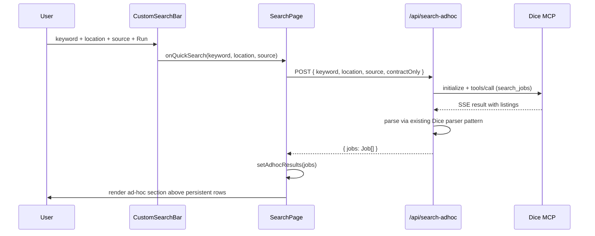

# Search Feature Parity Restoration — bring lost UX back into the v1 reader

## Overview

CAR-188 shipped the architectural inversion (workstation owns scheduled search, Supabase is the seam, dashboard reads). Unit 7's page rewrite was honest about the data-layer change but too aggressive about the UX — it dropped most of the search-tab features while repointing to the new reader. CAR-190 restores those features against the new `job_search_results` data shape, plus adds one ad-hoc-search escape hatch so the user can do live keyword/location searches from the dashboard the way they could before.

The plan is four phases. Phase A restores per-row actions (Tailor / Cover Letter / Apply / Queue / Track+Tailor) — pure additive UI work, no architectural impact. Phase B restores list-level UX (profile chips inline-editable, quick filters, advanced filters, query mode, fit scoring, sort, auto-queue toggle, scan metadata) — also pure additive, just porting filter logic to the new row shape. Phase C is the architecturally interesting one: a new `/api/search-adhoc` route that calls Dice MCP directly for live searches without persisting to `job_search_results`. Phase D is optional history-grouping by `discovered_at` date.

## Problem Frame

The pre-CAR-188 `/search` page was a complete job-hunt cockpit: live search, profile chips, history, quick + advanced + query filters, fit scoring, sorting, auto-queue toggle, and per-row actions for Track / Apply / Tailor / Cover Letter / Add to Queue / Track+Tailor. CAR-188's Unit 7 reduced this to: status/source/profile dropdown filters, a list of result rows, a basic detail panel with apply link, and a Track button. Tab nav, Suggestions tab, and Auto-Apply tab were preserved; everything else inside the Search tab was cut.

The user surfaced this 24 hours after CAR-188 shipped: feature regression on Tailor / Cover Letter / Queue (orthogonal to the data-source switch and should not have been removed), missing custom search (depended on `/api/search-{indeed,dice}` routes that Unit 8 deleted), and missing list-level UX (filters / chips / history). Some items are pure restoration; one (custom search) requires re-deciding how live search interacts with the new architecture.

## Requirements Trace

(See origin: this session's audit + the legacy `(main)/search/page.tsx` at commit `1ee30b9`)

- **R1 (Per-row Tailor):** From any search-results row, open `TailorModal` and generate a tailored resume; if the row is already tracked, attach the resume to the application; otherwise stash for next Track click.
- **R2 (Per-row Cover Letter):** Same flow as R1 but with `CoverLetterModal`.
- **R3 (Per-row Apply):** Open `ApplyFlow` modal from any row; on `applied`, status flips and `date_applied` set on the underlying `applications` row (creates one if not yet tracked).
- **R4 (Per-row Track+Tailor):** Combined "track this job AND immediately open Tailor" — single click.
- **R5 (Per-row Add to Queue):** Add a row to `auto_apply_queue` with its computed `FitScore`. Disabled if already in queue.
- **R6 (Fit scoring):** Compute `FitScore` for each row using `lib/fit-scoring::scoreJob` against `useSkillsInventory` skills. Show `FitScoreBadge` per row.
- **R7 (Profile chips inline):** Show all enabled `search_profiles` as chips; allow inline edit / duplicate / hide / delete via the existing `ProfileChips` component, not a separate profile-management page.
- **R8 (Quick filters):** Restore `SearchFiltersBar` on the new data — remote-only, easy-apply-only, source filter, salary-range filter.
- **R9 (Advanced filters):** Restore `AdvancedFiltersPanel` — per-company filtering, location autocomplete, date-range filter on `discovered_at`.
- **R10 (Query mode):** Restore `QueryMode` and `QueryModeToggle` — free-text query parser (`title:devops AND remote NOT contractor`).
- **R11 (Sort options):** Restore newest / fit / salary / company sort.
- **R12 (Auto-queue toggle):** Restore the persistent toggle that auto-adds rows scoring ≥ 80 with `easy_apply=true` to the auto-apply queue.
- **R13 (Scan metadata header):** Restore "Last scan: Today 7:00 AM — N new jobs" header from `/api/scan-results`.
- **R14 (Custom ad-hoc search):** From the dashboard, run a free-text keyword / location / source query against Dice MCP. Results render inline. Do NOT persist to `job_search_results` (ephemeral). Allow Track / Apply / Tailor / Cover Letter / Queue actions on ad-hoc results just like persistent results.
- **R15 (Search history by date):** Optional. Group `job_search_results` by `discovered_at` calendar date; click a date to filter the list to that day.

**Success criteria:**
1. Every action a user could take from the legacy `/search` page is reachable from the new page (with the single exception of the legacy `search_runs`-style history if R15 is deferred).
2. `npm run build` green; regression-check.sh shows no NEW failures vs the post-CAR-188 baseline (1 pre-existing CAR-182).
3. Custom search returns results in ≤ 5 seconds for a single profile-shaped query.
4. Per-row actions integrate with existing `useApplications`, `useAutoApplyQueue`, `useSearchProfiles` hooks unchanged.
5. The architectural inversion holds: scheduled search results still flow workstation → Supabase → dashboard. Custom-search results are ephemeral / dashboard-only.

## Scope Boundaries

- **Not in scope:** Indeed Firecrawl path, LinkedIn scraping, relevance ranker (all deferred to CAR-189).
- **Not in scope:** Cleanup of fully-orphaned legacy components (`use-search.ts`, `search-history.tsx`, `custom-search-bar.tsx`, etc.) that this plan does not re-use. Those land under CAR-189 cleanup.
- **Not in scope:** New auto-apply-queue features — only restore the existing "add 80+ Easy Apply automatically" toggle and the per-row Queue button.
- **Out of scope entirely:** Multi-user / shared search-queue workflows.

### Deferred to Implementation

- **Phase D** (search history by date) is optional. If the date-grouping UX feels redundant with the existing `last_seen_at DESC` ordering, drop it.
- **Per-row layout decision** between rendering all action buttons inline on the row (legacy JobCard pattern) vs putting quick actions on the row and the full set on DetailPanel. Implementation chooses based on visual density at typical row counts.
- **Query mode parser** — port-as-is from `lib/query-parser.ts`, but if the parser depends on `Job` shape rather than `JobSearchResultRow`, write a small adapter rather than rewriting the parser.

## Context & Research

### Relevant Code and Patterns

**Pre-CAR-188 page (deleted in Unit 7, available in commit `1ee30b9`):**
- `git show 1ee30b9:dashboard/src/app/(main)/search/page.tsx` — full reference for what the cockpit looked like.
- All 1040 lines were one file; this plan keeps the new page leaner by extracting tab-content blocks into sub-components where natural.

**Existing components NOT deleted by Unit 7/8** (still importable, just unwired):
- `dashboard/src/components/shared/job-card.tsx` — the legacy per-row card with all action buttons. **Reusable.**
- `dashboard/src/components/search/profile-chips.tsx` — inline edit / duplicate / hide / delete. **Reusable.**
- `dashboard/src/components/search/search-controls.tsx` — Run/Stop/progress. **Repurpose** as Refresh + realtime indicator (or drop and use Supabase realtime UX directly).
- `dashboard/src/components/search/search-filters.tsx` (`SearchFiltersBar`, `DEFAULT_FILTERS`). **Reusable** with adapter.
- `dashboard/src/components/search/advanced-filters.tsx`. **Reusable** with adapter.
- `dashboard/src/components/search/query-mode.tsx` (`QueryMode`, `QueryModeToggle`). **Reusable** with adapter.
- `dashboard/src/components/search/fit-score-badge.tsx`. **Reusable as-is**.
- `dashboard/src/components/search/job-detail-pane.tsx` — old detail pane. **Don't reuse**; CAR-188's `DetailPanel` is the canonical detail view going forward.
- `dashboard/src/components/applications/tailor-modal.tsx`, `cover-letter-modal.tsx` — **Reusable**.
- `dashboard/src/components/search/apply-flow.tsx` — **Reusable**.
- `dashboard/src/lib/fit-scoring.ts::scoreJob` — takes `Job` shape. Need a `jobSearchResultRowToJob(row)` adapter (one-direction, lossy is fine).
- `dashboard/src/lib/search-filter-utils.ts` (`applyFilters`, `applyAdvancedFilters`) — takes `Job[]`. Same adapter handles this.
- `dashboard/src/lib/query-parser.ts` (`parseQuery`, `applyQueryFilter`) — same adapter.

**New components shipped in CAR-188 Unit 7:**
- `dashboard/src/hooks/use-search-results.ts` — fetcher with `applySearchResultFilters` filter pipeline.
- `dashboard/src/lib/search-results/filters.ts` — current filter pipeline (status / source / profile_id). Will compose with the legacy quick / advanced / query filters via the adapter pattern.
- `dashboard/src/lib/search-results/track-input.ts` — `JobSearchResultRow → addApplication input` mapping (already correct for ad-hoc results too).
- `dashboard/src/components/search/result-row.tsx` — list-item shell. **Will be expanded** with action buttons (Phase A).
- `dashboard/src/components/search/detail-panel.tsx` — slide-in panel. **Will be expanded** with Tailor / Cover Letter / Apply / Queue actions (Phase A).
- `dashboard/src/components/search/track-button.tsx` — Track flow with dedup via `application_id` (Phase A keeps).

**Type adapter (the linchpin):**

```ts
// dashboard/src/lib/search-results/to-job.ts (NEW)
import type { JobSearchResultRow } from "@/types/supabase"
import type { Job } from "@/types"

export function rowToJob(row: JobSearchResultRow): Job {
  return {
    title: row.title ?? "",
    company: row.company ?? "",
    location: row.location ?? "",
    salary: row.salary ?? "Not listed",
    url: row.url,
    posted: row.posted_date ?? "",
    type: row.job_type ?? "",
    source: (row.source.charAt(0).toUpperCase() + row.source.slice(1).toLowerCase()) as Job["source"],
    easyApply: row.easy_apply,
    profileId: row.profile_id ?? "",
    profileLabel: row.profile_label ?? "",
  }
}
```

This single adapter unlocks reuse of `scoreJob`, `applyFilters`, `applyAdvancedFilters`, `applyQueryFilter`, all the existing modals (which take `Job`), and `JobCard` if we choose to reuse it instead of expanding `ResultRow`. **Trivial** but architecturally important — it's what makes Phase A and B fit in 4-5 hours instead of 15.

**Existing API routes to reference (not in this plan; for context):**
- `/api/auto-apply/generate-batch`, `/api/auto-apply/session` — used by Auto-Apply Queue tab, untouched.
- `/api/scan-results` — used by R13 scan metadata header, untouched.
- `/api/extract-job` — used by paste-URL flow on Applications page, NOT relevant here.

### Institutional Learnings

- **`docs/plans/2026-04-27-001-feat-careerpilot-job-search-cli-v1-plan.md`** (CAR-188) — the parent plan. Note the explicit warning at the bottom of the conversation audit that "Unit 7 over-aggressively dropped UX features." This plan exists *because* of that lesson.
- **`MEMORY.md::cli-sqlite-vs-dashboard-supabase-split.md`** — the dashboard reads `applications`, `contacts`, `job_search_results`, `search_profiles`, `auto_apply_queue` from Supabase; everything CAR-190 touches is in this set already.
- **The `Job` interface is the de-facto interop type** for everything that pre-dated CAR-188 (search, fit scoring, queue, modals, JobCard). Working WITH it via an adapter is much cheaper than rewriting downstream consumers to take `JobSearchResultRow`.

### External References

- N/A. All patterns are in-repo.

## Key Technical Decisions

- **Use the `rowToJob` adapter pattern** to bridge `JobSearchResultRow` → `Job` for downstream consumers (`scoreJob`, `applyFilters`, `applyAdvancedFilters`, `applyQueryFilter`, all existing modals, optionally `JobCard`). Single shared seam, no parallel duplicated code paths. *Reversible if the adapter accumulates too many lossy edge cases — at that point we'd consider migrating downstream consumers to take `JobSearchResultRow` directly. Not v1.*
- **Custom search via Option A — new `/api/search-adhoc/route.ts`**. Resurrects the same Dice MCP transport pattern from the deleted `/api/search-dice/route.ts` but with three differences: (1) does NOT write to `job_search_results`; (2) returns the parsed `Job[]` payload in the HTTP response; (3) accepts the same `keyword`/`location`/`contractOnly`/`source` shape the legacy `CustomSearchBar` already produces. Dashboard uses this for the live-search UX; the scheduled CLI engine remains the canonical persistent-search path. *Alternative considered:* "workstation watcher" (Option B) — rejected because it needs a new CLI watcher process that doesn't exist; *Option C "temp profile + manual"* rejected for UX reasons.
- **Reuse the legacy `JobCard` component** wrapped over `rowToJob(row)` rather than expanding `ResultRow`. JobCard already has all the action buttons, fit-score display, "tracked" affordance, source-color border. `ResultRow` becomes a thin wrapper that calls `JobCard`. *Reversible* — if visual divergence is desired we extract.
- **DetailPanel keeps its full set of actions** (Tailor / Cover Letter / Apply / Queue / Track) plus the description / requirements / nice-to-haves layout. Per-row actions on the list are a subset (Track / Apply / Queue, with Tailor / Cover Letter / Track+Tailor moved into the panel). This avoids visual clutter at the row level while keeping deep actions one click away.
- **Custom search results stay client-side state** — they don't merge into `useSearchResults` rows. The page renders TWO sections when both are populated: "Custom search results" (top, ephemeral) and "From the morning run" (the persistent rows). Closing custom search clears the ephemeral set.
- **Auto-queue 80+ toggle** keys off both persistent rows AND ad-hoc results. Same logic applied to both sets after fit-scoring.
- **R15 (search history by date)** uses a thin client-side group-by on `discovered_at` rather than touching `search_runs`. Avoids reanimating a deprecated table.

## Open Questions

### Resolved During Planning

- **Custom search architecture (A/B/C)** — Resolved: Option A (new `/api/search-adhoc` route, Dice-only, ephemeral). User-validated direction.
- **Where actions live (row vs panel)** — Resolved: split. Row gets Track / Apply / Queue. Panel gets the full set including Tailor / Cover Letter / Track+Tailor. (Phase A may revisit if the row feels too sparse.)
- **JobCard reuse vs ResultRow expansion** — Resolved: reuse JobCard via `rowToJob` adapter; ResultRow becomes a thin wrapper. Avoids parallel maintenance.
- **Is ad-hoc search Track-able?** — Resolved: yes. Track creates an `applications` row from the ad-hoc result; no `job_search_results` row is created. The new application's `source_id` field stays null (it didn't come from a scheduled scan).

### Deferred to Implementation

- **Final layout of action buttons on the row** — depends on actual visual density in the dev environment. Implementation chooses between (a) all 6 inline like legacy JobCard, (b) 3 inline + 3 in panel, (c) icon-only inline + label on hover. Recommendation: start with (b), revisit if cluttered.
- **Custom search debounce / submit semantics** — instant-submit on Enter vs explicit "Run" button. Recommendation: explicit Run (matches legacy `CustomSearchBar`).
- **Auto-queue toggle persistence key** — legacy used `careerpilot_auto_queue_enabled` localStorage. Keep the same key for continuity.
- **Scan metadata header click target** — legacy displayed it but didn't make it clickable. Phase B: keep non-clickable; if user wants drill-down behavior, file a follow-up.
- **Phase D inclusion** — decide at end of Phase C based on remaining time / appetite. The default is to ship A + B + C and assess.

## Output Structure

```
dashboard/src/
├── app/api/
│   └── search-adhoc/
│       └── route.ts                      # NEW (Phase C) — Dice MCP direct, ephemeral
├── lib/search-results/
│   └── to-job.ts                          # NEW (Phase A) — rowToJob adapter
├── components/search/
│   ├── result-row.tsx                     # MODIFY (Phase A) — wrap JobCard via rowToJob
│   ├── detail-panel.tsx                   # MODIFY (Phase A) — add Tailor/CoverLetter/Apply/Queue
│   ├── custom-search-bar.tsx              # REUSE (Phase C) — wire to /api/search-adhoc
│   ├── profile-chips.tsx                  # REUSE (Phase B) — re-add to page
│   ├── search-filters.tsx                 # REUSE (Phase B) — re-add to page
│   ├── advanced-filters.tsx               # REUSE (Phase B)
│   ├── query-mode.tsx                     # REUSE (Phase B)
│   └── fit-score-badge.tsx                # REUSE (Phase A)
├── components/shared/
│   └── job-card.tsx                       # REUSE (Phase A) — used by ResultRow now
├── components/applications/
│   ├── tailor-modal.tsx                   # REUSE (Phase A)
│   └── cover-letter-modal.tsx             # REUSE (Phase A)
├── app/(main)/search/
│   └── page.tsx                           # MODIFY (Phases A/B/C/D) — restore the cockpit
└── __tests__/
    ├── lib/search-results/
    │   └── to-job.test.ts                 # NEW (Phase A) — adapter coverage
    └── api/
        └── search-adhoc.test.ts           # NEW (Phase C) — route smoke test
```

## High-Level Technical Design

### Phase A — Per-row actions

```
JobSearchResultRow  →  rowToJob(row)  →  Job (legacy shape)
                                              │
                  ┌───────────────────────────┼───────────────────────────┐
                  ▼                           ▼                           ▼
              JobCard                  scoreJob(job, skills)         existing modals
        (all 6 action buttons)            FitScore                (Tailor / Cover / Apply)
```

`ResultRow` becomes:

```tsx
function ResultRow({ row, selected, onSelect, ...handlers }) {
  const job = rowToJob(row)
  const fitScore = useMemo(() => scoreJob(job, skills), [row.id, skills])
  return <JobCard
    job={job}
    onTrack={() => handlers.onTrack(row)}
    onApply={() => handlers.onApply(row)}
    onTailor={() => handlers.onTailor(row)}
    onCoverLetter={() => handlers.onCoverLetter(row)}
    onTrackAndTailor={() => handlers.onTrackAndTailor(row)}
    onAddToQueue={() => handlers.onAddToQueue(row)}
    onViewDetails={() => onSelect(row)}
    tracked={!!row.application_id}
    isNew={row.status === "new"}
    fitScore={fitScore}
    inQueue={handlers.isInQueue(row)}
  />
}
```

`DetailPanel` gains the same actions plus the description / requirements blocks (already there).

### Phase B — List-level UX

Page-level filter pipeline:

```
allRows (from useSearchResults)
   │
   ▼  applySearchResultFilters(profileId, status, source)        // existing
   │
   ▼  rowsAsJobs = rows.map(rowToJob)
   │
   ▼  applyFilters(rowsAsJobs, quickFilters)                     // legacy quick filters
   │
   ▼  applyAdvancedFilters(prev, advancedFilters)                // legacy advanced
   │
   ▼  applyQueryFilter(prev, parseQuery(queryString))            // legacy query mode
   │
   ▼  fit-scoring + sort
   │
   ▼  render list of ResultRow
```

Auto-queue 80+ effect: after each filter pass, scan results, add 80+ Easy-Apply rows to `auto_apply_queue` if not already present. Same effect runs over ad-hoc search results.

### Phase C — Custom (ad-hoc) search



`route.ts` mirrors the deleted `/api/search-dice/route.ts` but skips persistence. Reuses the same Dice MCP transport pattern as the Python engine (`searcher.py`), including the optional-session-id fix (CAR-188 late fix).

### Phase D — History by date (optional)

Client-side `groupBy(discoveredAt → date)` over the persistent rows. UI: a horizontal date strip above the list; clicking a date sets a `discovered_at` filter on `useSearchResults`.

## Implementation Units

- [ ] **Unit A1: rowToJob adapter + tests**

  **Goal:** Single one-direction adapter from `JobSearchResultRow` to legacy `Job`. Unblocks every downstream consumer.

  **Files:**
  - Create: `dashboard/src/lib/search-results/to-job.ts`
  - Create: `dashboard/src/__tests__/lib/search-results/to-job.test.ts`

  **Approach:** Pure function. Lossy where the schemas don't align (e.g., `Job.salary` defaults to "Not listed" if `row.salary` is null; `Job.source` is the capitalized form). No external deps.

  **Test scenarios:** Round-trip parity with `JobSearchResultRow` fixtures from CAR-188 tests; null-handling on every nullable field; capitalization invariants (`indeed` → `Indeed`).

  **Verification:** `npm test -- to-job` green.

- [ ] **Unit A2: ResultRow wraps JobCard**

  **Goal:** Replace `result-row.tsx` body with a `JobCard` wrapper using the adapter; pass through all action handlers.

  **Files:** Modify `dashboard/src/components/search/result-row.tsx`.

  **Approach:** See HLD above. Keep the `selected` highlight from CAR-188; everything else delegates to `JobCard`.

  **Test scenarios:** Snapshot of rendered output for a single fixture; click on each action button calls the right handler with the full `JobSearchResultRow` (not the lossy `Job`).

  **Verification:** `npm test`, `npm run build` green.

- [ ] **Unit A3: DetailPanel gains Tailor / Cover Letter / Apply / Queue actions**

  **Goal:** Add the same six action buttons to the panel header, alongside the existing Apply link + Track button.

  **Files:** Modify `dashboard/src/components/search/detail-panel.tsx`.

  **Approach:** Add a horizontal action strip below the title row. Buttons open existing modals (Tailor / CoverLetter / Apply) or call the existing handlers (Queue). Reuse `useApplications`, `useAutoApplyQueue` directly inside the panel rather than threading more props.

  **Test scenarios:** Each button click invokes the right side effect; modals open/close; status flip on first-open still works.

- [ ] **Unit A4: SearchPage wires per-row handlers**

  **Goal:** Implement page-level handlers for `onTrack` / `onApply` / `onTailor` / `onCoverLetter` / `onTrackAndTailor` / `onAddToQueue` against `JobSearchResultRow`. Mirrors the legacy `handleTrack`/`handleTrackAndTailor`/`handleApplied` from the pre-CAR-188 page but adapted to the new data shape.

  **Files:** Modify `dashboard/src/app/(main)/search/page.tsx`.

  **Approach:** Bring back the `tailoredResumesRef` + `coverLettersRef` stash refs from the legacy page (allows tailor-before-track flow). Use `rowToJob` once per row when calling modal-bound handlers.

  **Test scenarios:** Track creates application + flips row status + stamps `application_id`; Track+Tailor opens TailorModal and saves resume to the new application; Apply on un-tracked row creates application then flips status to `applied`; Queue adds to auto_apply_queue with computed FitScore.

- [ ] **Unit B1: Restore profile chips with inline actions**

  **Goal:** Add `ProfileChips` to the page above the result list, wired to `useSearchProfiles` for create/update/delete and `localStorage` for hidden state (legacy keys reused).

  **Files:** Modify `dashboard/src/app/(main)/search/page.tsx`.

  **Approach:** Direct port of the legacy page's `ProfileChips` block (lines ~739-756 in the legacy file). Selected profiles drive the existing `profileFilter` state on the new page (replacing the dropdown filter).

  **Test scenarios:** Edit a profile name → `search_profiles` row updates; Hide → localStorage updated; Delete → row deleted (only non-default).

- [ ] **Unit B2: Quick filters + advanced filters + query mode + sort**

  **Goal:** Compose legacy filter pipelines on top of `applySearchResultFilters` via `rowToJob`.

  **Files:** Modify `dashboard/src/app/(main)/search/page.tsx`.

  **Approach:** Map filtered rows through `rowToJob` once, apply legacy filters, then render. Sort runs after filtering. Query mode toggle replaces filters when active (matches legacy mutual-exclusivity).

  **Test scenarios:** Each filter narrows the result set; sort options re-order; clearing filters restores the full set.

- [ ] **Unit B3: Fit scoring badge + auto-queue 80+ toggle + scan metadata header**

  **Goal:** Wire `scoreJob` per-row via the adapter; restore the auto-queue effect; restore the `/api/scan-results` header.

  **Files:** Modify `dashboard/src/app/(main)/search/page.tsx`.

  **Approach:** Memoize fit scores keyed by row id; pass into `ResultRow` and the auto-queue effect. The auto-queue effect reads the toggle from localStorage (legacy key) and runs after each filter pass. Scan metadata header is a copy-paste of the legacy block.

  **Test scenarios:** Fit score appears on each row; toggling auto-queue ON queues newly-eligible rows; scan header renders when `/api/scan-results` returns data.

- [ ] **Unit C1: `/api/search-adhoc` route**

  **Goal:** New POST route that accepts `{ keyword, location, source, contractOnly }`, calls Dice MCP directly, returns `{ jobs: Job[] }`. Does NOT touch Supabase.

  **Files:**
  - Create: `dashboard/src/app/api/search-adhoc/route.ts`
  - Create: `dashboard/src/__tests__/api/search-adhoc.test.ts`

  **Approach:** Mirror the deleted `/api/search-dice/route.ts` from commit `1ee30b9` (`git show 1ee30b9:dashboard/src/app/api/search-dice/route.ts`), with two changes: (1) the response includes the parsed jobs directly rather than persisting; (2) include the optional-session-id fix from CAR-188's late commit (don't bail when Dice doesn't return `mcp-session-id`).

  **Test scenarios:** Mock fetch to Dice MCP returning a known SSE payload → route returns parsed `Job[]`; Dice MCP returns rate-limit error → route returns 503 with the error message; missing keyword → 400.

  **Verification:** `npm test`, `npm run build` green; manual `curl` against `localhost:3000/api/search-adhoc` returns parsed listings.

- [ ] **Unit C2: CustomSearchBar wired to ad-hoc route**

  **Goal:** Re-add `CustomSearchBar` to the page; on submit, POST to `/api/search-adhoc` and render results in an "Ad-hoc results" section above the persistent rows.

  **Files:** Modify `dashboard/src/app/(main)/search/page.tsx`.

  **Approach:** Reuse the existing `CustomSearchBar` component as-is. Add a `useState<Job[]>([])` for ad-hoc results, render in a new section that disappears when empty.

  **Test scenarios:** Submit a search → ad-hoc section populates; close section → state clears; auto-queue + per-row actions all work on ad-hoc results (using the existing handlers, since they take `Job` already after Phase A's adapter pattern).

- [ ] **Unit D1: History by date (optional)**

  **Goal:** Client-side group-by `discovered_at` calendar date; UI strip of dates above the list; click a date to filter.

  **Files:** Modify `dashboard/src/app/(main)/search/page.tsx`.

  **Approach:** `useMemo` grouping; render dates as small chips with row counts; clicking sets a `discoveredAtFilter` on `useSearchResults`.

  **Decision gate:** Skip if A+B+C feels complete enough.

## System-Wide Impact

- **Interaction graph:** No new tables, no schema changes. New ephemeral pathway: `CustomSearchBar → /api/search-adhoc → Dice MCP → Job[]`. Existing pathways unchanged.
- **Error propagation:** Custom search errors return 503/400 from the route; page surfaces a toast. Persistent search behavior is unchanged from CAR-188.
- **State lifecycle risks:** None new. Custom search results are pure client state with no Supabase persistence.
- **API surface change:** Adds `/api/search-adhoc` (POST). No deletes. No contract changes to existing routes.
- **Integration coverage:** Reuses `useApplications.addApplication`, `useAutoApplyQueue.addToQueue`, all existing modals — all of which already work. The only NEW seam is `rowToJob`.
- **Unchanged invariants:** `applications`, `contacts`, `job_search_results`, `search_profiles`, `auto_apply_queue` schemas. CLI engine. Scheduled task. Discord summary. Indeed deferral. Track-flow navigation pattern.

## Risks & Dependencies

| Risk | Likelihood | Impact | Mitigation |
|---|---|---|---|
| `rowToJob` is lossy on a field that breaks `scoreJob` | Low | Medium | A2 tests cover round-trip on all fields; visual smoke after Phase A |
| `JobCard` styling clashes with the new `DetailPanel` aesthetic | Medium | Low | Decide in Unit A2 whether to ship JobCard as-is or do a small visual refresh |
| `/api/search-adhoc` hits Dice MCP rate limits during bursty UI clicks | Medium | Medium | Per-IP cooldown in route; toast surfacing the rate-limit message |
| Auto-queue effect re-fires on every filter change and re-queues already-queued items | Low | Low | `isInQueue` check before `addToQueue` (legacy already does this) |
| Custom search results merging with persistent rows confuses users | Low | Medium | Render in a separate section with a clear "Ad-hoc results" header + close button |
| Phase A reveals additional missing features beyond the audit list | Medium | Low | Each phase ends with a "did anything else surface?" checkpoint; new findings get added to a Phase E or a follow-up ticket |
| The orphaned `use-search.ts` hook drifts further out-of-date | Low | Low | Delete in CAR-189 cleanup, not here |

## Phased Delivery

**Phase A — Per-row actions** (Units A1, A2, A3, A4 — sequential)
- Adapter + ResultRow + DetailPanel + page handlers.
- Gate: Track / Apply / Tailor / Cover Letter / Track+Tailor / Add to Queue all functional from a result row.

**Phase B — List-level UX** (Units B1, B2, B3 — parallelizable, but order suggested above)
- Profile chips + filters + fit scoring + auto-queue + scan metadata.
- Gate: Page UX matches legacy `/search` for everything except custom search and history.

**Phase C — Custom search** (Units C1 then C2 — sequential)
- New ad-hoc route + bar wired in.
- Gate: User can do an ad-hoc keyword search and see results.

**Phase D — History by date** (Unit D1 — optional)
- Decision gate at end of Phase C: ship D, or close out.

## Documentation / Operational Notes

- Update `dashboard/feature-manifest.json` after each phase: add new entries for `to-job.ts`, `result-row.tsx` (refresh patterns), `detail-panel.tsx` (refresh patterns), `search-adhoc/route.ts`, `custom-search-bar.tsx` (re-tagged to CAR-190).
- After Phase A: spot-check `regression-check.sh` — should still be 1 FAIL (pre-existing CAR-182). Anything new is a defect.
- After all phases: compound a solutions doc at `docs/solutions/workflow-issues/CAR-190-feature-parity-restore.md` capturing the lesson — *"data-source switches don't justify removing UX features"* — for future-self.

## Sources & References

- **Origin (audit):** This session's conversation, the user's screenshot of the build error + feature regression report.
- **Legacy code reference:** Commit `1ee30b9` (just-before-CAR-188 state). All deleted files retrievable via `git show 1ee30b9:<path>`.
- **Predecessor plan:** `docs/plans/2026-04-27-001-feat-careerpilot-job-search-cli-v1-plan.md` (CAR-188).
- **v2 tracker:** CAR-189.
- **Manager + adapter precedent:** `dashboard/src/lib/search-results/track-input.ts` (Unit 7) — same pattern, smaller scope.
- **`Job` interface:** `dashboard/src/types/index.ts:1-12`.
- **`JobSearchResultRow`:** `dashboard/src/types/supabase.ts` + `dashboard/src/types/database.types.ts`.
