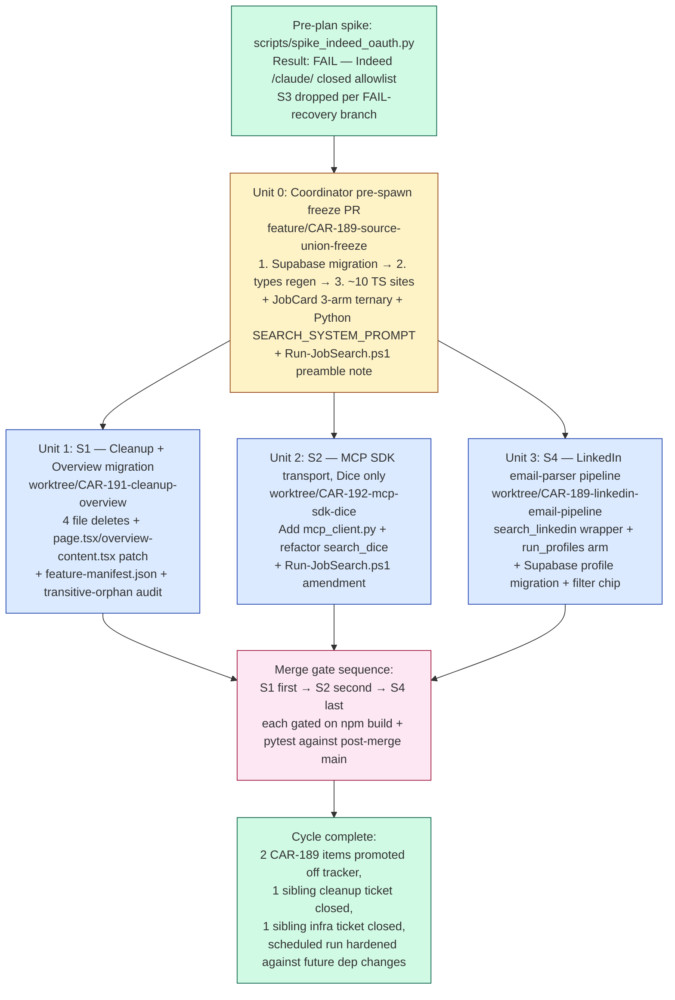

# Job Search v2 bundle — cleanup, MCP SDK migration, LinkedIn integration

## Cycle Status (updated 2026-04-27 23:00 EST)

**Phase 0a — pre-plan complete.**
- [x] Pre-plan auth spike: FAIL (Indeed `/claude/` closed allowlist; S3 dropped). Diagnostic in CAR-189 comment 16502.
- [x] Spinoff tickets filed: CAR-191 (cleanup), CAR-192 (MCP SDK narrowed).
- [x] Plan written.
- [x] Plan reviewed (document-review pass 1 complete; correctness fixes applied 2026-04-27 23:00).

**Phase 0b — freeze PR (Unit 0): NOT STARTED.** Coordinator owns; non-worktree feature branch `feature/CAR-189-source-union-freeze`. Sequence in §Merge gate.

**Phase 1 — streams: BLOCKED on Phase 0b completion.**

When picking up this plan in a future session, advance the checkboxes above and proceed from the first un-checked item.

## Overview

This cycle delivers three independent streams behind a single coordinator-owned pre-spawn freeze PR. The scope is the post-spike reshape of CAR-189's v2 bundle: dashboard cleanup with a follow-on Overview-stat migration (CAR-191), Python MCP SDK transport migration narrowed to the Dice path (CAR-192, narrowed after spike FAIL), and LinkedIn integration via the existing email parser (anchored on CAR-189). The Indeed adapter (S3) was dropped after the pre-plan auth spike confirmed Indeed's MCP `/claude/` endpoint enforces a closed client allowlist; the relevance ranker (S5) was deferred during the brainstorm review pass.

### Stream-to-Unit mapping (from brainstorm reshape)

| Brainstorm | Plan | Status |
|---|---|---|
| S1 — Cleanup | Unit 1 | Active (CAR-191) |
| S2 — MCP SDK | Unit 2 | Active (CAR-192, narrowed) |
| S3 — Indeed MCP | Dropped | Spike FAIL — closed allowlist |
| S4 — LinkedIn email-parser | Unit 3 | Active (anchored on CAR-189) |
| S5 — Ranker | Deferred | Re-evaluate after 2026-05-25 |
| (none) | Unit 0 | Coordinator pre-spawn freeze (not a stream — non-worktree feature branch) |

## Problem Frame

CAR-188 (Job Search v1) shipped on 2026-04-27 with Dice-only coverage. The CAR-189 v2 tracker held 8 deferred items; this cycle picks 2 (Indeed scraping, LinkedIn scraping) plus 2 sibling tickets that share files and reviewers (cleanup, MCP SDK migration). The pre-plan auth spike (`scripts/spike_indeed_oauth.py`) ran on 2026-04-27 22:20 EST and definitively ruled out the "Indeed MCP via Claude.ai connector" strategy — Indeed's `/claude/` endpoint rejects every dynamically-registered OAuth client with `403 invalid_client`. S3 dropped per the brainstorm's documented FAIL-recovery branch. The cycle reshaped to 3 streams in a single phase, behind a coordinator pre-spawn freeze PR for source-type union widening.

(See origin: `docs/brainstorms/2026-04-27-CAR-189-v2-bundle-requirements.md`.)

## Requirements Trace

- **R1.** Delete the four confirmed-orphaned dashboard files (`use-search.ts`, `search-history.tsx`, `use-search-history.ts`, `job-detail-pane.tsx`) without silently breaking the Overview "new matches in 24h" stat. (origin §S1)
- **R2.** Migrate the Overview stat from `search_cache` (write-orphaned after the deletes) to `job_search_results.created_at`. (origin §S1, R-S1-4)
- **R3.** Replace the hand-rolled MCP Streamable HTTP code in `src/jobs/searcher.py::_search_dice_direct` with calls through the official `mcp` Python SDK. Pure transport refactor for the Dice path. (origin §S2, R-S2-1 to R-S2-3)
- **R4.** Wire `src/jobs/linkedin_cli.py::cmd_scan` and `linkedin_parser.py` into `src/jobs/search_engine.py::run_profiles` so LinkedIn rows land in `job_search_results` alongside Dice. (origin §S4, R-S4-1 to R-S4-4)
- **R5.** Render LinkedIn rows in the dashboard with a visually-distinct source badge and filter-chip support. (origin §S4, R-S4-5)
- **R6.** Promote the "Indeed scraping" item off CAR-189 as **ruled-out (Claude.ai-connector path)** with the spike outcome documented; mark "LinkedIn scraping" as **partially resolved (email-parser path)** with web scraping for full-index coverage retained as a v3 candidate. (origin §S3 — Indeed; §S4-6 — LinkedIn; per scope-guardian F7 of plan-review pass 1, "promoted off" framing softened to honest disposition)
- **R7.** Eliminate the operational hazard between S2's `requirements.txt` change and the daily 06:30 scheduled CLI run — `Run-JobSearch.ps1` currently has no `git pull` or `pip install` preamble. **(Plan-derived requirement, not in brainstorm origin — surfaced during plan-time research by spec-flow-analyzer.)**

## Scope Boundaries

- **Indeed adapter (S3)** dropped after pre-plan spike FAIL. Future cycles can pursue the remaining CAR-189 strategies (residential proxy, headless browser, Indeed Partner API) — each requires its own brainstorm.
- **Relevance ranker (S5)** deferred. Re-evaluate after 2026-05-25 once v1's badge + Discord engagement surface has produced 2–4 weeks of behavioral data.
- **LinkedIn web scraping** explicitly out of scope. The `cmd_scan` email-parser path covers a curated subset of LinkedIn's index; web scraping faces the same bot-detection wall Firecrawl hit on Indeed and would need its own brainstorm.
- **OAuth + persistent token storage** dropped from S2's scope (was originally R-S2-3/R-S2-4 in the brainstorm). After S3 dropped, the OAuth scaffolding had no consumer; carrying it would be pre-investment in a future Indeed strategy that hasn't been brainstormed.
- **Deletion of `search_runs` and `search_cache` Supabase tables** explicitly deferred. After R-S1-4 lands, no code reads or writes them; the table-drop migration is a follow-up cleanup ticket (see Open Question Q2).

### Deferred to Separate Tasks

- **Migration of `src/jobs/enrichment.py` and the `careerpilot-research` skill to the SDK transport** — only if they use the hand-rolled pattern. Default: follow-up unless trivial. (Open Question Q1)
- **`LINKEDIN_SEARCH_PROFILES` migration into Supabase** versus parallel registration path — planning resolves this in Q4 below; either way, the work happens in S4 directly.
- **LinkedIn detail enrichment** (full description, requirements via fetching `linkedin.com/jobs/view/<id>`) — same bot-detection wall as Indeed scraping; defer until v3 if dashboard UX feels thin.

## Context & Research

### Relevant Code and Patterns

- **MCP transport (current hand-rolled):** `src/jobs/searcher.py:66-172` (`_search_dice_direct`). Manually walks initialize → `notifications/initialized` → `tools/call`, parses SSE `data:` events, defensively forwards `mcp-session-id` only when present (Dice doesn't assign one as of 2026-04-27).
- **Search-engine dispatch:** `src/jobs/search_engine.py:203-226`. Flat `if`-chain on `source` — not a registry. S4 adds an `if source == "linkedin":` arm before the Dice fallthrough; S2 swaps the default `_dice_fn` from `_search_dice_direct` to a new `call_mcp_tool_sync(...)` helper.
- **Existing test pattern:** `tests/test_search_engine.py` uses dependency injection via the `dice_search_fn` parameter on `run_profiles(...)` (defined at `src/jobs/search_engine.py:131,150,174`). Mock fixture `_make_dice_mcp_result` at `tests/test_search_engine.py:59-74` builds the expected MCP `structuredContent` shape. **No `httpx`/`requests` mocks anywhere in `tests/`** — keep the DI seam for unit tests; add ONE new integration test patching the SDK's `streamable_http_client` boundary.
- **Async precedent:** None. Grep for `async def` and `asyncio` in `src/` returns zero hits. This migration introduces the codebase's first async pattern; the `def call_mcp_tool_sync(...)` wrapper around `asyncio.run(call_mcp_tool(...))` is the bridge for sync callers.
- **Migration naming:** `dashboard/supabase/migrations/YYYYMMDDHHMMSS_car_NNN_<snake_summary>.sql`. Most recent two: `20260427000000_*` and `20260427000001_*` (manual ordinal suffix). Freeze-PR migration: `20260427000002_car_189_widen_source_linkedin.sql`.
- **CHECK widening pattern:** `dashboard/supabase/migrations/20260427000001_car_188_reshape_search_profiles.sql:28-33` — `BEGIN; ALTER TABLE … DROP CONSTRAINT IF EXISTS <name>_check; ALTER TABLE … ADD CONSTRAINT <name>_check CHECK (col = ANY (ARRAY[...])); COMMIT;`. Apply to both `job_search_results_source_check` (currently `('indeed', 'dice')` at `…20260427000000_…sql:16`) and `search_profiles_source_check` (`…20260427000001_…sql:33`).
- **Type regen:** `dashboard/package.json:12` defines `npm run types:generate` → `supabase gen types typescript --project-id kfrffocrfnnuimwrngcs > src/types/database.types.ts`. Freeze PR runs this post-migration.
- **Feature-manifest entries to delete:** `dashboard/feature-manifest.json` — "Search Hook" (~lines 185-198), "Search History Panel" (~lines 212-224), "Search History Hook" (~lines 225-238), "Job Detail Pane" (~lines 2247-2259). Verify trailing-comma cleanup after the last deletion.
- **Daily scheduled-run script:** `scripts/Run-JobSearch.ps1:120` — invokes `python -m cli search run-profiles` directly. **No `git pull`, no `pip install`, no venv refresh.**

### Institutional Learnings

- **`docs/solutions/car-pilot-subagent-swarm-learnings.md`** (CAR-181 retrospective): coordinator T_avg ~2 min validates the v1 swarm process; shared-interface freeze worked clean on first try (C→D rebase); v1.1 frictions to pre-empt — (1) avoid allowlisted gitleaks keys in smoke tests, (2) dashboard worktrees need `npm install` + `cp ../../.env.local .` preamble (gitignored files don't carry across worktrees), (3) serial-tail streams should skip mid-flight checkpoints when no parallel stream is live.
- **`docs/solutions/workflow-issues/transcripts-kind-consolidation-2026-04-15.md`**: leaf-module canonical-enum pattern (CANONICAL_KINDS in lowest-level module to avoid circular imports during `click.Choice()` decoration) — applies to where the source-type union lives Python-side. Define the union once in the lowest shared module on each side (Python + TS) and freeze before spawn.
- **No prior solutions** for: MCP Python SDK migrations, Supabase CHECK-constraint widening, auto-generated `database.types.ts` regen, feature-manifest cleanup, LinkedIn email-parser integration, or hand-rolled SSE/session-id replacement. All are net-new compounding candidates — see Documentation Plan.

### External References

- **`mcp` Python SDK (PyPI):** Latest stable `1.27.0` (released 2026-04-02). https://pypi.org/project/mcp/
- **SDK README — Streamable HTTP client:** https://github.com/modelcontextprotocol/python-sdk/blob/main/README.md (canonical 12-line client pattern that the helper reduces to)
- **SDK migration doc:** https://github.com/modelcontextprotocol/python-sdk/blob/main/docs/migration.md (intra-SDK v1→v2; documents the deprecated `streamablehttp_client` alias and forthcoming v2 breakages)
- **OAuth client example (kept for forward compat, not used this cycle):** `examples/snippets/clients/oauth_client.py` in the SDK repo

## Key Technical Decisions

- **MCP SDK pin: `mcp>=1.27,<2.0`.** 1.27.0 is the latest stable; v2 is documented as imminent with breaking changes (drops the deprecated `streamablehttp_client` alias, returns a 2-tuple from the client, requires explicit `follow_redirects=True`). The 1.x line has shipped breaking minor bumps in the last 5 months — do not loosen the upper bound.
- **Helper name: `streamable_http_client` (not `streamablehttp_client`).** Both exist in 1.27.0 but the new name survives the v2 cut. SDK README's own examples use the new name.
- **Helper signature:** `async def call_mcp_tool(url: str, tool_name: str, arguments: dict, *, auth: httpx.Auth | None = None) -> dict` plus `def call_mcp_tool_sync(...) -> dict` (thin `asyncio.run` wrapper). The `auth=` kwarg lives on the helper but is passed internally to `httpx.AsyncClient(auth=auth)` — the new SDK helper does **not** accept `auth=` directly. `OAuthClientProvider` is an `httpx.Auth` subclass, so this signature is forward-compatible with future Indeed work.
- **Tuple unpacking: `as (read, write, _)`.** 1.27 yields a 3-tuple (third slot is `get_session_id` callback); v2 will yield 2-tuple. Write the 3-tuple unpack today and add a `# TODO: drop _ after mcp v2` comment.
- **Result conversion:** `session.call_tool` returns a typed `CallToolResult`, not a dict. Helper unwraps as: `result.structuredContent` (when present, the shortest path to a dict matching the existing Dice consumer) → otherwise `{"content": [c.model_dump() for c in result.content]}`. Tool-level errors raise via `result.isError=True` → custom `McpToolError`. Transport errors propagate as `mcp.shared.exceptions.McpError` / `httpx.HTTPStatusError` / `httpx.ConnectError` / `httpx.ReadTimeout`. No SDK-level `call_tool` timeout exists — timeouts come from `httpx.Timeout(read=...)` on the AsyncClient.
- **LinkedIn source-badge color: `#475569` (slate-gray) — confirmed by user 2026-04-27.** Resolves the open design decision in origin §R-S4-5 and Q-NEW-1 from plan-review pass 1. Distinct from both blues (Indeed `#2557a7`, Dice `#0c7ff2`); ΔE2000 ~14 vs Indeed. Trade-off: ambiguous at scrolling speed on the 4-px border stripe — accepted; revisit only if user reports confusion in production.
- **LinkedIn source string is `"Linkedin"` (title-case), NOT `"LinkedIn"` (camel-case).** Critical codebase fact: `dashboard/src/lib/search-results/to-job.ts:23-24` normalizes any database `source` value via `charAt(0).toUpperCase() + slice(1).toLowerCase()`. So the migration value `'linkedin'` (lowercase, per CHECK constraint) becomes `"Linkedin"` after `rowToJob`. The plan's JobCard 3-arm rewrite, the `SOURCE_OPTIONS` filter chip `value`, and any client-side `job.source === ...` comparison MUST use `"Linkedin"`. Comparing to `"LinkedIn"` would silently fall through to the Dice default color and the filter chip would silently return zero LinkedIn rows. **This applies to Units 0 (JobCard) and 3 (filter chip + dashboard rendering).**
- **JobCard ternary belongs in the freeze PR**, not in S4 — confirmed by user 2026-04-27. `dashboard/src/components/shared/job-card.tsx:21` is currently a 2-arm ternary; widening it to 3-arm is part of the source-union widening, not LinkedIn-specific work. Bundling into the freeze PR keeps the freeze atomic and tightens S4's scope to LinkedIn-specific work (parser wiring + filter chip + Supabase upsert path). Resolves Q-NEW-2 from plan-review pass 1.
- **Run-JobSearch.ps1 amendment ships in S2's PR.** Add `git pull --ff-only` + `python -m pip install -r requirements.txt --quiet` preflight before the cli invocation, **with explicit `$LASTEXITCODE` checks after each native command** (PowerShell 7.0–7.3's `$ErrorActionPreference = 'Stop'` does NOT govern native exit codes; `$PSNativeCommandUseErrorActionPreference` is preview in 7.3, stable only in 7.4 — opting in is more reliable than relying on it being set). Pattern: `git pull --ff-only; if ($LASTEXITCODE -ne 0) { throw "git pull failed: $LASTEXITCODE" }`. Same for `pip install`. Permanent fix; closes a latent class of bugs where any future Python-side dep change can break the scheduled run silently. Alternative considered: gate S2's merge to a post-06:30 window — rejected as a one-time mitigation that doesn't address the underlying fragility.
- **`LINKEDIN_SEARCH_PROFILES` → Supabase migration in S4.** Resolves Q4. The `search_profiles` table (per CAR-188) is already canonical for Indeed/Dice; making LinkedIn the same preserves single source of truth and avoids a parallel registration path that would defeat the brainstorm's "additive registration" frozen interface.
- **Merge order: any post-freeze order is safe — confirmed by user 2026-04-27.** The conflict matrix shows zero file overlap between Units 1, 2, 3 (post-freeze). The brainstorm explicitly said "any subset can ship in any post-freeze order." Each merge is gated on `npm run build` + `python -m pytest tests/` against post-merge `main`, not the PR branch in isolation. **Coordinator may merge in arrival order or by hand-pick** — no ordering ceremony. Resolves Q-NEW-3 from plan-review pass 1. (Original plan asserted S1→S2→S4 for "smallest blast radius first"; reviewers correctly flagged it as ceremony that added coupling without clear technical benefit.)
- **Cross-source visual duplication accepted as v3.** Resolves Q5. A job appearing in both LinkedIn alert emails and Dice MCP renders as two cards (different source badges, different URLs). The dashboard's active read path no longer runs client-side title+company dedup. Document this as known behavior; revisit if the user reports it as a UX problem.

## Open Questions

### Resolved During Planning

- **Q1: Does S2 also migrate `enrichment.py` and the `careerpilot-research` skill?** **Resolved: defer as follow-up** unless trivial — discovered during S2 implementation. The plan's §S2 (Unit 2) scope is Dice transport only.
- **Q2: Drop `search_runs` and `search_cache` tables in S1?** **Resolved: defer to a follow-up cleanup ticket** filed after S1 ships. Dropping tables alongside R-S1-4's reader migration adds risk without payoff; the tables are harmless once write-orphaned.
- **Q3: LinkedIn detail enrichment in S4?** **Resolved: ship without** — same bot-detection wall as Indeed scraping. Revisit only if dashboard UX feels thin (which the basic title/company/location/salary fields should not produce).
- **Q4: `LINKEDIN_SEARCH_PROFILES` migration approach?** **Resolved: migrate into Supabase `search_profiles` table** in S4 — preserves single source of truth, matches Dice/Indeed precedent, fits the additive-registration frozen interface.
- **Q5: Cross-source visual duplication policy?** **Resolved: accept duplication as v3 candidate**, document as known behavior. UX-driven group-by-(title, company) and source-priority routing both warrant their own brainstorm.

### Deferred to Implementation

- **Exact Pydantic model attribute access for `CallToolResult`.** The 1.27 docs show `.structuredContent`, `.content`, `.isError` — but the implementer should verify against `pip show mcp` output and the installed source.
- **Freeze-leakage discoveries.** A subagent may discover a missed `'indeed' | 'dice'` literal in a `.tsx` file the freeze PR's grep missed (e.g., interpolated string, or test fixture). The freeze-leakage protocol below handles in-stream patches; the specific files are unknowable until streams run.
- **`feature-manifest.json` exact line ranges.** Approximate ranges given in §S1 Files; implementer reads the file and applies precise line-range deletes. Use the entries' stable `name` fields (`"Search Hook"`, `"Search History Panel"`, `"Search History Hook"`, `"Job Detail Pane"`) as grep targets — line numbers may have drifted by execution time.
- **Supabase types regen diff scope.** `npm run types:generate` may emit additional generated artifacts beyond the union widening (e.g., new RLS policy types). The freeze PR's diff is reviewed before merge; unexpected output triggers a Supabase-branch dry-run rerun.

### Surfaced by plan-review pass 1 (3 of 8 resolved by user 2026-04-27)

These open questions came from the document-review pass on 2026-04-27. The first three (Q-NEW-1 through Q-NEW-3) were resolved by the user during the same session. Q-NEW-4 through Q-NEW-8 remain at their defaults; the executing implementer should respect the default unless the user resolves the question first.

- **Q-NEW-1 — LinkedIn badge color: RESOLVED 2026-04-27 — slate-gray `#475569`.** User confirmed the default. Trade-off (ambiguity at scrolling speed) accepted; revisit only if user reports confusion.
- **Q-NEW-2 — JobCard color decision: RESOLVED 2026-04-27 — Unit 0 owns the color.** User confirmed the default. Freeze PR commits both the 3-arm ternary AND the slate-gray value.
- **Q-NEW-3 — Merge order: RESOLVED 2026-04-27 — any post-freeze order is safe.** User confirmed the recommended option. Plan's Key Technical Decisions and Parallelization Map § Merge gate updated to reflect arrival-order merging gated on post-merge build + test.
- **Q-NEW-4 — Mocked SDK boundary test value.** adversarial F3 (HIGH 0.85) argued the test mocks both `streamable_http_client` AND `ClientSession.call_tool`, leaving only the conversion shim under test — verifying a tautology. The existing DI seam already covers the same boundary. Alternative: drop the mocked test and rely on the live Dice smoke + DI seam tests; or replace it with a VCR-recorded fixture. Default: keep both (mocked + live smoke) — redundant but cheap.
- **Q-NEW-5 — `pip install` daily supply-chain hardening.** adversarial F9 (MOD 0.75) flagged daily auto-install as a small-but-real attack surface (compromised package version, transient PyPI 503, non-deterministic resolution). Alternatives: (a) gate `pip install` on `requirements.txt` mtime change since last run, (b) introduce a lockfile (`pip-tools`), (c) run weekly instead of daily. Default: ship as written (daily, change-detection guard accepted as future work).
- **Q-NEW-6 — Live Dice smoke degraded-state procedure.** adversarial F10 (MOD 0.68) — what if Dice MCP rate-limits the smoke, returns 0 jobs legitimately, or is fully down? Plan asserts `>0 jobs` is the criterion. Default: if smoke fails for any non-auth reason, document the failure mode in the PR description and proceed with merge after a 2nd canonical query attempt; if both fail, defer the merge until Dice is healthy.
- **Q-NEW-7 — LinkedIn failure-state user signal.** design-lens F5 (HIGH 0.82) — failures in the LinkedIn arm produce zero rows silently; the user has no in-dashboard indication that LinkedIn ran but found nothing vs failed entirely. Alternatives: (a) add a "last run" timestamp on the search page, (b) per-source row count in Overview, (c) accept the silence and document it. Default: accept the silence; revisit if the user notices missing LinkedIn rows.
- **Q-NEW-8 — Documentation Plan tier.** scope-guardian F4 (HIGH 0.82) — 5 compounding entries listed; 2 are weak (`feature-manifest-cleanup` and `linkedin-integration` overlap with brainstorm content). Alternatives: drop the 2 weak ones, or tier them as "write only if time permits." Default: keep all 5 in the Documentation Plan as a wishlist; coordinator decides at compounding time which actually ship.

## High-Level Technical Design

> *This illustrates the cycle's intended shape and is directional guidance for review, not implementation specification. The implementing agents should treat it as context, not code to reproduce.*



## Parallelization Map

This section follows the CAR-181 swarm-pilot precedent (`docs/plans/2026-04-25-001-car-pilot-parallelization-map.md`). It is the authoritative reference the coordinator uses for stream concurrency, shared-interface freezes, scope auditing, and checkpoint approval.

### Stream count

**4 total: 1 coordinator-owned freeze PR (Unit 0) + 3 parallel-eligible streams (Units 1, 2, 3).**

The freeze PR runs first (no worktree — coordinator commits directly to a feature branch off main, merges, deploys). After merge + Vercel deploy + post-deploy SQL verification, all 3 streams spawn simultaneously.

### Streams

| Stream | Ticket | Worktree branch | Files touched (proposed) | Depends on | Merge order | Intent summary |
|---|---|---|---|---|---|---|
| Unit 0 (coordinator) | CAR-189 | `feature/CAR-189-source-union-freeze` (no worktree) | `dashboard/supabase/migrations/20260427000002_car_189_widen_source_linkedin.sql` (new); `dashboard/src/types/database.types.ts` (regenerated); `dashboard/src/types/index.ts:333`; `dashboard/src/lib/search-results/filters.ts:8`; `dashboard/src/hooks/use-search-profiles.ts:14`; `dashboard/src/components/search/custom-search-bar.tsx:18,32`; `dashboard/src/app/(main)/search/page.tsx:569,606`; `dashboard/src/components/shared/job-card.tsx:21` (2-arm ternary → 3-arm with `#475569`); `src/jobs/searcher.py:37` (SEARCH_SYSTEM_PROMPT prompt-string update) | Pre-plan spike (complete, FAIL) | 0 (pre-merge) | Source-type union widens from `'indeed' \| 'dice'` to `'indeed' \| 'dice' \| 'linkedin'` across all enumerated sites; Supabase CHECK constraints on `job_search_results.source` and `search_profiles.source` accept `'linkedin'`; JobCard renders LinkedIn rows as slate-gray (`#475569`) badges. |
| Unit 1 (S1) | CAR-191 | `worktree/CAR-191-cleanup-overview` | DELETE `dashboard/src/hooks/use-search.ts`; DELETE `dashboard/src/components/search/search-history.tsx`; DELETE `dashboard/src/hooks/use-search-history.ts`; DELETE `dashboard/src/components/search/job-detail-pane.tsx`; MODIFY `dashboard/src/app/(main)/page.tsx:30`; MODIFY `dashboard/src/app/(main)/overview-content.tsx:259`; MODIFY `dashboard/feature-manifest.json` (4 entries removed at approx lines 185-198, 212-224, 225-238, 2247-2259); DELETE `dashboard/src/lib/search-utils.ts` (transitive orphan, if grep confirms zero remaining importers); DELETE `dashboard/src/__tests__/lib/search-utils.test.ts` | Unit 0 | 1 (any after Unit 0) | Four post-CAR-190 orphans deleted; Overview "new matches in last 24h" stat reads from `job_search_results.created_at` filtered by `user_id`; transitive search-utils orphans cleaned up; `feature-manifest.json` reflects the new tree; `npm run build` and `tools/regression-check.sh` green; visual confirmation against Overview page renders a plausible non-zero count. |
| Unit 2 (S2) | CAR-192 | `worktree/CAR-192-mcp-sdk-dice` | CREATE `src/jobs/mcp_client.py`; MODIFY `src/jobs/searcher.py` (replace `_search_dice_direct` body with helper call; remove SSE-parsing block; keep `JobSearcher.search_dice` shape unchanged); MODIFY `requirements.txt` (add `mcp>=1.27,<2.0`); MODIFY `tests/test_search_engine.py` (Dice mock fixture untouched; add new integration test patching `mcp.client.streamable_http.streamable_http_client`); CREATE `tests/test_mcp_client.py`; MODIFY `scripts/Run-JobSearch.ps1` (add `git pull --ff-only` + `python -m pip install -r requirements.txt --quiet` preflight at line ~120) | Unit 0 | 2 (after Unit 1 lands) | Hand-rolled MCP Streamable HTTP code in `searcher.py` replaced with calls through the official `mcp` Python SDK; new `mcp_client.py` exposes `async call_mcp_tool` + `def call_mcp_tool_sync` with `auth=None` forward-compat slot; existing `JobSearcher.search_dice` behaves identically (same input → same normalized output); Dice integration test mocks at the SDK boundary; one-time live Dice smoke documented in PR; `Run-JobSearch.ps1` hardened against future dep changes. |
| Unit 3 (S4) | CAR-189 | `worktree/CAR-189-linkedin-email-pipeline` | CREATE `dashboard/supabase/migrations/20260427000003_car_189_seed_linkedin_profiles.sql`; CREATE `src/jobs/linkedin_search.py` (or extend `src/jobs/searcher.py` with a `search_linkedin` method); MODIFY `src/jobs/search_engine.py:203-226` (add `if source == "linkedin":` arm); MODIFY `dashboard/src/components/search/search-filters.tsx:48` (extend `SOURCE_OPTIONS`); MODIFY `dashboard/src/lib/search-filter-utils.ts` (widen `SearchFilters['source']` type); CREATE `tests/test_linkedin_search.py` | Unit 0 | 3 (after Units 1 and 2 land) | LinkedIn rows from Gmail alert emails land in `job_search_results` with `source='linkedin'`, `source_id=<linkedin_job_id>`; dashboard renders them with the slate-gray badge from Unit 0; `SOURCE_OPTIONS` filter chip lets users isolate LinkedIn results; `LINKEDIN_SEARCH_PROFILES` migrated into the Supabase `search_profiles` table with `source='linkedin'`; the "LinkedIn scraping" item on CAR-189 is promoted off with the email-parser path noted as the chosen approach. |

### Shared interfaces frozen before spawn

**1. Source type union** — `'indeed' | 'dice' | 'linkedin'`.

- **Owner during freeze:** Coordinator (Unit 0).
- **Sites enumerated:** see Unit 0's "Files touched" column above. Approximately 10 TS sites + 1 SQL migration (with 2 CHECK constraints) + 1 generated `database.types.ts` regen + 1 Python prompt string + 1 JobCard ternary rewrite.
- **Why frozen:** S4 (Unit 3) extends the union; multiple dashboard streams consume it. Without a freeze, each stream extends independently and merge conflicts.
- **Stream contract:** S1, S2, S4 must NOT modify any union site enumerated in Unit 0. Discoveries of missed sites use the freeze-leakage protocol below.

**2. `call_mcp_tool` / `call_mcp_tool_sync` helper signatures**.

- **Owner during freeze:** S2 (Unit 2) — the helpers don't exist pre-Unit-2.
- **Frozen value:** `async def call_mcp_tool(url: str, tool_name: str, arguments: dict, *, auth: httpx.Auth | None = None) -> dict` and `def call_mcp_tool_sync(url: str, tool_name: str, arguments: dict, *, auth: httpx.Auth | None = None) -> dict`.
- **Why frozen:** Forward-compatibility with future Indeed/LinkedIn auth flows. The `auth=None` default lets S2 ship the helper without an authentication-layer dependency. No consumer in this cycle.

**3. `search_engine.run_profiles` per-source dispatch shape**.

- **Owner during freeze:** Plan-level decision (no rewrite).
- **Frozen value:** existing flat `if source == 'X': ...; continue` chain at `src/jobs/search_engine.py:203-226`. No refactor to a registry pattern.
- **Why frozen:** S2 modifies the Dice arm to use the new helper; S4 adds a LinkedIn arm. Two streams need to add or modify branches concurrently. Freezing the additive shape prevents either stream from refactoring it.

### Pre-spawn overlap check

Coordinator runs before spawning Units 1, 2, 3:

```sh
$ for f in <each unit's declared file list>; do
    echo "=== $f ==="
    grep -l "$f" <other units' declared files>
  done
```

Expected results:

- Unit 1 ↔ Unit 2: zero overlap (dashboard vs Python).
- Unit 1 ↔ Unit 3: dashboard types touched by Unit 0's freeze (zero residual after freeze land); `search-filters.tsx` (Unit 3 only — different file from Unit 1's deletes); zero overlap on remaining files.
- Unit 2 ↔ Unit 3: `src/jobs/search_engine.py` — Unit 2 modifies the Dice arm at line ~226; Unit 3 adds a LinkedIn arm before the Dice arm. **Different line ranges.** Plan-level freeze on the dispatch shape (additive only) prevents conflict.
- Unit 0 ↔ Units 1/2/3: Unit 0 lands first; Units 1/2/3 rebase on post-Unit-0 main before their checkpoint commits.

If runtime overlap is found that's not in this matrix, that's a friction point for the post-cycle learnings doc.

### Runtime overlap check

After each subagent's checkpoint commit, the coordinator runs (in the subagent's worktree):

```sh
git -C .worktrees/<branch_dir> diff main...HEAD --name-only
```

Output is compared against:

1. The unit's declared "Files touched" list (above).
2. Other units' actual committed paths (cumulative — query each worktree's `git diff main...HEAD --name-only`).

**Drift signals:**

- File touched that's not in the declared list → coordinator rejects checkpoint, re-dispatches with "return to scope."
- File touched that overlaps another unit's actual commits → coordinator either rebases the smaller unit onto the larger one's branch or escalates if the conflict is non-trivial.
- A union literal `'indeed' | 'dice'` modified outside Unit 0's enumerated sites → freeze-leakage discovery (see protocol below).

### Freeze-leakage protocol

If a stream subagent discovers a missed source-union literal during its work (e.g., a `.tsx` file the freeze PR's grep missed because of casing, interpolation, or a test fixture):

1. Subagent commits the one-line patch in its own worktree branch.
2. Commit message references both the stream ticket and CAR-189: `"fix(CAR-189): freeze-leak — widen source union in <path>:<line>"`.
3. Subagent flags the discovery in its checkpoint summary with the tag `[freeze-leak: <path>:<line>]`.
4. Coordinator validates against the intent summary at merge — if the patch matches the freeze's intent, it rides along; otherwise the coordinator may pull it into a separate freeze-followup PR.
5. **Do not re-spawn the coordinator's freeze PR** — that adds a serial gate for what is at most a one-line ride-along.

### Merge gate

**Order (post Q-NEW-3 resolution — any post-freeze order is safe):**

1. Unit 0 (freeze PR) lands first via the sub-sequence: (a) Supabase migration applied via `mcp__claude_ai_Supabase__apply_migration` against a Supabase branch first (`mcp__claude_ai_Supabase__create_branch` for dry-run); (b) `npm run types:generate` regenerates `database.types.ts`; (c) ~10 TS sites + JobCard ternary + Python prompt string updated; (d) PR opens, `npm run build` + `python -m py_compile` checks pass; (e) merged to main; (f) Vercel deploy completes; (g) post-deploy SQL verification: `SELECT pg_get_constraintdef(oid) FROM pg_constraint WHERE conname = 'job_search_results_source_check'` returns the new constraint with `'linkedin'`; (h) post-deploy build-on-main verification.
2. Coordinator dispatches Units 1, 2, 3 in parallel against post-Unit-0 main. Each subagent's worktree starts from a fresh clone (or fresh fetch + reset) at the post-freeze tip.
3. **Streams merge in any order** as their PRs become ready. The conflict matrix (see Parallelization Map § Conflict zones) shows zero file overlap between Units 1, 2, 3 post-freeze. Coordinator dispatches a "rebase" instruction to each worktree before its merge: `git fetch origin && git rebase origin/main`.
4. Unit 2's PR includes the `Run-JobSearch.ps1` preamble amendment.

**Verification between landings:**

- After Unit 0 lands: Vercel deploy green, SQL constraint check passes, `npm run build` and `python -m pytest tests/` against `main` both green.
- After each stream lands (1, 2, or 3 — in arrival order): same suite (`npm run build` + `python -m pytest tests/`) against the new main.
- Before declaring the cycle complete: confirm all three streams are stable (no follow-up commits needed after their merges).

**Operational guardrail:** Unit 2's merge MUST NOT happen in the 60-min window before 06:30 EST (the daily scheduled CLI run). The `Run-JobSearch.ps1` amendment is in Unit 2's PR — once merged, future cycles are protected; but during the merge window, the amendment hasn't run yet on the workstation. Either time the merge outside the window, or manually run `git pull && python -m pip install -r requirements.txt` on the workstation immediately after merge.

### Checkpoint commit (meaningful first commit) definition

Per the global INFRA-216 contract: a subagent's first commit MUST both:

1. Modify at least one production-code file in its declared "Files touched" list, AND
2. Exercise the core premise of its intent summary — typically an interface plus a failing test, or the smallest vertical slice that touches real behavior.

For each unit:

- **Unit 0 (coordinator freeze PR):** No checkpoint-commit requirement — this is a non-worktree PR landing directly to a feature branch. Verification is post-merge: (1) Supabase migration applies and types regenerate cleanly, (2) no residual `'indeed' | 'dice'` literals remain in the enumerated sites (grep confirms), (3) `npm run build` green against post-merge main, (4) post-deploy SQL constraint check confirms `'linkedin'` is in both CHECK clauses.
- **Unit 1 (S1):** First commit = patch `dashboard/src/app/(main)/page.tsx:30` + `overview-content.tsx:259` to read from `job_search_results.created_at` AND delete one of the four orphans (start with `use-search.ts` since it has zero importers). Verifies the migration shape before bulk deletion.
- **Unit 2 (S2):** First commit = `src/jobs/mcp_client.py` with the helper signatures + a failing integration test in `tests/test_mcp_client.py` that patches `mcp.client.streamable_http.streamable_http_client`. Verifies the boundary contract before refactoring `search_dice`.
- **Unit 3 (S4):** First commit = the `linkedin_parser.scan_emails` helper + a fixture-driven unit test in `tests/test_linkedin_parser.py` asserting it produces the expected normalized shape AND raises on Gmail-client unavailable. Verifies the side-effect-free path before wiring the search-engine dispatch arm.

## Implementation Units

### - [ ] **Unit 0: Source-type union freeze + JobCard 3-arm rewrite (coordinator pre-spawn)**

**Goal.** Widen the `'indeed' | 'dice'` source-type union to `'indeed' | 'dice' | 'linkedin'` across all sites enumerated in the Parallelization Map's Unit 0 row, regenerate `database.types.ts`, rewrite the JobCard ternary to a 3-arm conditional with LinkedIn slate-gray (`#475569`), and merge before any subagent spawns. **Unit 0 is the precondition for Units 1, 2, 3** — they cannot spawn until this PR is merged and Vercel-deployed.

**Requirements:** **R-FREEZE** (precondition: source-type union widening across Python + TypeScript + Supabase), R4 (LinkedIn integration touchpoints), R5 (dashboard rendering preconditions). The R-FREEZE work is implicit in R4/R5 but not enumerated as a separate brainstorm-level requirement; this plan unit owns it.

**Dependencies:** Pre-plan auth spike (complete, FAIL — see brainstorm § "Pre-Plan Auth Spike Outcome"). Both spinoff tickets filed (CAR-191, CAR-192). **Coordinator preconditions:** (1) `supabase login` succeeded OR `SUPABASE_ACCESS_TOKEN` is set in shell env (required by `npm run types:generate` — verified before step (b) of the merge gate; see Risks R-NEW for rollback if absent). (2) Coordinator has push access to the repo's `feature/CAR-189-source-union-freeze` branch.

**Files:**
- Create: `dashboard/supabase/migrations/20260427000002_car_189_widen_source_linkedin.sql`
- Modify: `dashboard/src/types/database.types.ts` (regenerated via `npm run types:generate`)
- Modify: `dashboard/src/types/index.ts:333`
- Modify: `dashboard/src/lib/search-results/filters.ts:8`
- Modify: `dashboard/src/hooks/use-search-profiles.ts:14`
- Modify: `dashboard/src/components/search/custom-search-bar.tsx:18,32`
- Modify: `dashboard/src/app/(main)/search/page.tsx:569,606`
- Modify: `dashboard/src/components/shared/job-card.tsx:21` (2-arm ternary → 3-arm with `#475569`)
- Modify: `src/jobs/searcher.py:37` (`SEARCH_SYSTEM_PROMPT` string)

**Approach:**
- Open a Supabase branch via `mcp__claude_ai_Supabase__create_branch` and apply the migration there first to verify the CHECK widening + types regen produce expected output.
- After branch verification, apply migration to main via `mcp__claude_ai_Supabase__apply_migration`.
- Run `npm run types:generate` post-migration.
- Update the 10 enumerated TS sites in a single commit alongside the Python prompt-string update.
- Rewrite `JobCard` ternary as a 3-arm conditional or lookup table: **`Indeed → #2557a7`, `Linkedin → #475569`, default (Dice) → `#0c7ff2`**. **Critical: compare to `"Linkedin"` (title-case), NOT `"LinkedIn"` (camel-case)** — `rowToJob` in `dashboard/src/lib/search-results/to-job.ts:23-24` normalizes via `charAt(0).toUpperCase() + slice(1).toLowerCase()`, producing `"Linkedin"`. The rewrite is a small refactor — the existing 2-arm ternary uses string equality; the 3-arm version mirrors that. (See Key Technical Decisions for the casing rationale.)
- PR description includes the post-deploy SQL verification snippet for the coordinator's merge gate.

**Patterns to follow:**
- CHECK widening pattern from `dashboard/supabase/migrations/20260427000001_car_188_reshape_search_profiles.sql:28-33` — `BEGIN; ALTER TABLE … DROP CONSTRAINT … ADD CONSTRAINT … COMMIT;`.
- Type-regen flow from `dashboard/package.json:12` (`npm run types:generate`).
- Migration filename convention: `YYYYMMDDHHMMSS_car_NNN_<snake_summary>.sql` with manual ordinal suffix for multiple migrations on the same date.

**Test scenarios:**
- *Test expectation: integration only — pure scaffolding/migration change. Verified by build success + post-deploy SQL constraint check.*
- *Integration:* After merge + Vercel deploy, `SELECT pg_get_constraintdef(oid) FROM pg_constraint WHERE conname IN ('job_search_results_source_check', 'search_profiles_source_check')` returns constraints whose definitions include `'linkedin'`.
- *Integration:* `npm run build` against the merged main is green.
- *Integration:* `npm run lint` against the merged main is green (catches any missed TS literal).
- *Edge case:* Re-applying the migration is a no-op (the `DROP CONSTRAINT IF EXISTS` makes it idempotent).
- *Edge case:* Vercel preview deploy on the freeze PR succeeds before merge.

**Verification:**
- Both Supabase CHECK constraints accept `'linkedin'` in production.
- `dashboard/src/types/database.types.ts` regeneration includes `'linkedin'` in the relevant union enum.
- JobCard renders a slate-gray badge when given `job.source === "LinkedIn"` (manually verified via React dev tools or a local fixture).
- No `'indeed' | 'dice'` literals remain in dashboard/src or src/jobs (grep returns zero hits — though see freeze-leakage protocol for stream-discovered residue).

---

### - [ ] **Unit 1: S1 — Cleanup + Overview "new matches" stat migration (CAR-191)**

**Goal.** Delete the four post-CAR-190 orphaned dashboard files, migrate the Overview "new matches in last 24h" stat off the now-write-orphaned `search_cache` table to read from `job_search_results.created_at`, and clean up the transitive search-utils orphans.

**Requirements:** R1, R2.

**Dependencies:** Unit 0 merged.

**Files:**
- Delete: `dashboard/src/hooks/use-search.ts`
- Delete: `dashboard/src/components/search/search-history.tsx`
- Delete: `dashboard/src/hooks/use-search-history.ts`
- Delete: `dashboard/src/components/search/job-detail-pane.tsx`
- Delete (transitive — grep confirmed zero non-self importers during plan-review pass 1; deletion is unconditional): `dashboard/src/lib/search-utils.ts`
- Delete (transitive): `dashboard/src/__tests__/lib/search-utils.test.ts`
- Modify: `dashboard/src/app/(main)/page.tsx:30`
- Modify: `dashboard/src/app/(main)/overview-content.tsx:259`
- Modify: `dashboard/feature-manifest.json` (4 entries removed at approx lines 185-198, 212-224, 225-238, 2247-2259)

**Approach:**
- Migration first (before deletes). Patch `page.tsx:30` and `overview-content.tsx:259` to query `job_search_results` filtered by `created_at > now() - interval '24 hours'` AND `user_id = <current user>`. Use the existing Supabase client pattern from neighboring code in the same files. **Note for the implementer:** the existing `search_cache` query at `page.tsx:30-32` does NOT scope by `user_id`. The new query DOES (correctly). Expect the post-migration count to be smaller-or-equal to the pre-migration count for any single-user environment — this is correct, not a regression. Don't interpret a smaller number as broken.
- **Caveat on `overview-content.tsx`:** `newMatchCount` is also referenced at lines 466-479 in prose ("found since yesterday") and at the empty-state branch (`alerts.length === 0 && newMatchCount === 0`). The migration preserves the surrounding visual context — the prose still reads correctly because the count is still "rows discovered in the last 24h," just sourced differently.
- Visual-confirm against the live Overview page that the new query produces a plausible non-zero count.
- Delete the four primary orphan files.
- Grep for any non-self importers of `dashboard/src/lib/search-utils.ts`. If zero importers, delete it and the test file. If imports remain, file a follow-up cleanup ticket and skip transitive deletion in this PR.
- Update `dashboard/feature-manifest.json` — remove the four enumerated entries; verify trailing-comma cleanup after the last removal.
- Run `npm run build` and `tools/regression-check.sh` locally. Both must pass.

**Patterns to follow:**
- Existing Supabase query pattern in adjacent code in `page.tsx` / `overview-content.tsx` (e.g., the way other 24h metrics are queried).
- CAR-181 swarm-pilot dashboard worktree preamble: from the worktree's `dashboard/` subdirectory, run `npm install` + `cp ../../../dashboard/.env.local .` after the worktree clone. **Path correction:** the CAR-181 retro doc's `cp ../../.env.local .` is wrong — `.env.local` lives at `<project-root>/dashboard/.env.local` (1843 bytes verified), not at project root, so from `.worktrees/<branch>/dashboard/` the correct relative path is `../../../dashboard/.env.local`. The retro doc should be corrected as a separate cleanup follow-up (file `docs/solutions/car-pilot-subagent-swarm-learnings.md`).

**Test scenarios:**
- *Happy path:* Overview "new matches in 24h" count, after migration, equals the count of `job_search_results` rows with `created_at > now() - interval '24 hours'` for the authenticated `user_id`. Verified via SQL + visual check.
- *Edge case:* Empty `job_search_results` (0 rows total) → count returns 0 (not null, not error).
- *Edge case:* All rows older than 24h → count returns 0.
- *Edge case:* Multiple users in the database (post-multi-tenant) → query scopes correctly to authenticated user.
- *Integration:* After deletion of the four orphan files, `npm run build` is green.
- *Integration:* `tools/regression-check.sh` green — no feature regression manifest entry goes PASS→FAIL.
- *Verification:* Visual confirmation against the live Overview page renders the new count (the regression-check is pattern-based and will not catch silent-empty-data, so manual visual check is required).

**Verification:**
- Four orphan files removed from the working tree.
- Overview page renders a "new matches in last 24h" count derived from `job_search_results.created_at`.
- `feature-manifest.json` no longer contains entries for any deleted file.
- `npm run build` and `tools/regression-check.sh` both green.

---

### - [ ] **Unit 2: S2 — MCP SDK transport migration (Dice only) + scheduled-run preflight (CAR-192)**

**Goal.** Replace the hand-rolled MCP Streamable HTTP code in `src/jobs/searcher.py` (`_search_dice_direct`, lines 66–172) with calls through the official `mcp` Python SDK; introduce `src/jobs/mcp_client.py` exposing async + sync helpers with `auth=None` forward-compatibility slots; amend `scripts/Run-JobSearch.ps1` to add a `git pull` + `pip install` preflight before the daily 06:30 CLI run, eliminating the operational hazard around `requirements.txt` changes.

**Requirements:** R3, R7.

**Dependencies:** Unit 0 merged.

**Files:**
- Create: `src/jobs/mcp_client.py`
- Create: `tests/test_mcp_client.py`
- Modify: `src/jobs/searcher.py` (replace `_search_dice_direct` body with helper call; remove SSE-parsing block; keep `JobSearcher.search_dice` shape unchanged)
- Modify: `requirements.txt` (add `mcp>=1.27,<2.0`)
- Modify: `tests/test_search_engine.py` (existing Dice tests stay using DI seam; add ONE new integration test patching `mcp.client.streamable_http.streamable_http_client`)
- Modify: `scripts/Run-JobSearch.ps1` (add `git pull --ff-only` + `python -m pip install -r requirements.txt --quiet` preflight at line ~120)

**Approach:**
- `mcp_client.py` exposes `async def call_mcp_tool(url, tool_name, arguments, *, auth=None) -> dict` and `def call_mcp_tool_sync(...) -> dict`. Internal flow uses `httpx.AsyncClient(auth=auth, follow_redirects=True, timeout=httpx.Timeout(30.0, read=300.0))`, then `async with streamable_http_client(url, http_client=http_client) as (read, write, _): async with ClientSession(read, write) as session: await session.initialize(); result = await session.call_tool(tool_name, arguments)`.
- Result conversion: `result.structuredContent` (preferred) → fallback to `{"content": [c.model_dump() for c in result.content]}`.
- Tool-level errors (`result.isError == True`) raise a custom `McpToolError` with a message extracted from `result.content`.
- Transport errors (`McpError`, `httpx.HTTPStatusError`, `httpx.ConnectError`, `httpx.ReadTimeout`) propagate. `JobSearcher.search_dice` keeps its existing `try/except: return []` contract — both SDK errors and httpx errors fall through to the existing `[]` fallback.
- Refactor `JobSearcher.search_dice` to invoke `call_mcp_tool_sync(DICE_MCP_URL, "search_jobs", {...})`. The result-shape transformation logic (extracting `structuredContent.data` or text-block JSON) STAYS — only the transport changes.
- Amend `Run-JobSearch.ps1`: insert four lines before the `python -m cli search run-profiles` invocation, **with explicit exit-code checks** (PowerShell 7.0–7.3 doesn't govern native exit codes via `$ErrorActionPreference = 'Stop'`):
  - `git pull --ff-only`
  - `if ($LASTEXITCODE -ne 0) { throw "git pull --ff-only failed (exit $LASTEXITCODE) — resolve uncommitted changes or branch tracking before next run" }`
  - `& $pythonExe -m pip install -r requirements.txt --quiet` (use the `$pythonExe` variable resolved by the existing `Get-Command` block at the top of the script — guarantees `pip` and `python` share an interpreter, including future venv setups)
  - `if ($LASTEXITCODE -ne 0) { throw "pip install failed (exit $LASTEXITCODE)" }`
- **Caveats noted in the script comment header:** (a) the script must be invoked against `main` or a tracking branch — `git pull` requires upstream tracking; (b) daily `pip install` is a small supply-chain surface — the project does not currently use a lockfile, so unbounded resolution is possible (see Risks R-NEW-2); (c) bandwidth + latency cost is ~30s/day.
- Run `python -m pytest tests/` locally. Update Dice mocks to target the SDK boundary.
- Run a one-time live Dice smoke against `mcp.dice.com` before merge — document the returned job count in the PR description.

**Execution note:** Test-first for the Dice integration test. The test mocks `mcp.client.streamable_http.streamable_http_client` and `ClientSession.call_tool` to return a fixture-built `CallToolResult`. Asserts that `JobSearcher.search_dice` returns the same normalized list it returned pre-migration for the same input.

**Patterns to follow:**
- Existing test DI seam: `dice_search_fn` parameter on `run_profiles(...)` and the `_make_dice_mcp_result(...)` fixture at `tests/test_search_engine.py:59-74`. Reuse the fixture's `structuredContent` shape.
- SDK README's canonical async pattern: https://github.com/modelcontextprotocol/python-sdk/blob/main/README.md#streamable-http
- This migration introduces the codebase's first `async def` and first `asyncio.run`. Document the bridging pattern in `mcp_client.py`'s module docstring so future maintainers don't think they're missing precedent.

**Test scenarios:**
- *Happy path:* `JobSearcher.search_dice("systems engineer", "Indianapolis")` returns the same normalized job list (same fields, same types) as it did pre-migration. Verified against the existing `_make_dice_mcp_result` fixture.
- *Integration (mocked SDK boundary):* Patch `mcp.client.streamable_http.streamable_http_client` to yield a fake `(read, write, _)` tuple; patch `ClientSession.call_tool` to return a `CallToolResult(structuredContent={"data": [...]}, isError=False)`. Helper returns the structuredContent dict; `JobSearcher.search_dice` normalizes correctly to a list of result dicts.
- *Error path (tool-level):* Mocked `call_tool` returns `CallToolResult(isError=True, content=[TextContent(text="rate limited")])`. Helper raises `McpToolError("rate limited")`. `JobSearcher.search_dice` catches and returns `[]` (matches existing fallback behavior).
- *Error path (transport):* Mocked `streamable_http_client` raises `httpx.ConnectError("connection refused")`. Helper propagates the exception. `JobSearcher.search_dice` catches and returns `[]`.
- *Error path (timeout):* Configure `httpx.Timeout(read=0.1)` and a slow stub. Helper raises `httpx.ReadTimeout`. `JobSearcher.search_dice` catches and returns `[]`.
- *Edge case (empty result):* Mocked `call_tool` returns `CallToolResult(structuredContent={"data": []}, isError=False)`. Helper returns `{"data": []}`; `JobSearcher.search_dice` returns `[]`.
- *Live smoke (one-time pre-merge):* Real Dice MCP returns >0 jobs for the canonical search (`keyword="systems engineer", location="Indianapolis"`). Document the count in the PR description.
- *Integration (preflight):* `Run-JobSearch.ps1` contains the new `git pull --ff-only` and `pip install -r requirements.txt --quiet` lines before the `cli search run-profiles` invocation. Verified by reading the file post-merge and a one-time manual run on the workstation.

**Verification:**
- `python -m pytest tests/` passes.
- `pip audit` against the new `mcp` dependency reports no known CVEs (or the known CVEs are documented and accepted).
- One live Dice smoke run produces a non-zero job count, documented in the PR.
- `Run-JobSearch.ps1` runs successfully on the workstation post-merge (manual one-time verification).
- Hand-rolled SSE-parsing block at `src/jobs/searcher.py:106-172` is gone; the function body is reduced to a `call_mcp_tool_sync` invocation + the existing result-shape transformation logic.

---

### - [ ] **Unit 3: S4 — LinkedIn email-parser pipeline integration**

**Goal.** Wire `src/jobs/linkedin_cli.py::cmd_scan` (already returns deduped job dicts) and `linkedin_parser.py` into `src/jobs/search_engine.py::run_profiles` so LinkedIn rows from Gmail alert emails land in `job_search_results` alongside Dice. Migrate `LINKEDIN_SEARCH_PROFILES` from `config/search_profiles.py` into the Supabase `search_profiles` table. Extend the dashboard's `SOURCE_OPTIONS` filter chip to include LinkedIn.

**Requirements:** R4, R5, R6 (LinkedIn promotion off CAR-189).

**Dependencies:** Unit 0 merged. (Independent of Units 1 and 2 at the file level, but coordinator merges S4 last per the merge-order rationale.)

**Files:**
- Create: `dashboard/supabase/migrations/20260427000003_car_189_seed_linkedin_profiles.sql`
- Modify: `src/jobs/linkedin_parser.py` (add new `scan_emails(gmail_service, days) -> list[dict]` pure helper; preserves no stdout output and raises on Gmail-client unavailable)
- Modify: `src/jobs/linkedin_cli.py` (refactor `cmd_scan` to call the new `scan_emails` helper; preserve its existing stdout prints for terminal use)
- Create: `src/jobs/linkedin_search.py` (new module — calls `linkedin_parser.scan_emails(gmail_service, days=2)` and adapts to the search_engine dispatch shape) — alternative: extend `src/jobs/searcher.py` with a `JobSearcher.search_linkedin` method. Plan recommendation: new module to keep LinkedIn-specific logic isolated.
- Modify: `src/jobs/search_engine.py:203-226` (add `if source == "linkedin":` arm before the Dice fallthrough; inject a `_linkedin_fn` parameter mirroring the existing `_dice_fn` pattern at line 174)
- Modify: `dashboard/src/components/search/search-filters.tsx:48` (extend `SOURCE_OPTIONS` to include `{ label: "LinkedIn", value: "Linkedin" }` — display label uses brand camel-case, but the value stored in filter state and compared against `job.source` is title-case `"Linkedin"`)
- Modify: `dashboard/src/lib/search-filter-utils.ts` (widen `SearchFilters['source']` type to include `"Linkedin"` title-case)
- Create: `tests/test_linkedin_parser.py` (covers `scan_emails` directly)
- Create: `tests/test_linkedin_search.py` (covers `JobSearcher.search_linkedin` integration with `search_engine.run_profiles`)

**Approach:**
- Migrate `LINKEDIN_SEARCH_PROFILES` into Supabase via a seed migration. Each LinkedIn profile gets a row in `search_profiles` with `source='linkedin'`, scoped by `user_id` from `settings.CAREERPILOT_USER_ID`.
- **Required preliminary refactor:** factor out a pure helper from `src/jobs/linkedin_cli.py::cmd_scan` — the current `cmd_scan` has 5 stdout `print` calls (lines 47, 85, 95, 97-102) and silently returns `[]` on Gmail auth failure (line 44). It is a Click CLI command designed for terminal interaction with a human, NOT safe to call from a non-interactive scheduled run (would balloon log files and hide auth failures). Add `src/jobs/linkedin_parser.py::scan_emails(gmail_service, days) -> list[dict]` that returns the deduped job list and **raises** on Gmail-client unavailable. Refactor `cmd_scan` to thinly wrap `scan_emails` for terminal use (preserving its prints). The new `JobSearcher.search_linkedin` calls `scan_emails` directly, NOT `cmd_scan`.
- New `JobSearcher.search_linkedin(...)` (or new module `linkedin_search.py`) calls `scan_emails(gmail_service, days=2)` for scheduled use (1-day overlap for Gmail labeling lag is sufficient; manual catchup commands continue to use `days=14` default via `cmd_scan`). Normalize the dict shape to match `search_dice`'s output — same fields, same types.
- `search_engine.py::run_profiles` adds an `if source == "linkedin":` arm that invokes `_linkedin_fn(...)`; the dispatch chain remains a flat `if`-chain (no refactor). Inject `_linkedin_fn` parameter mirroring `_dice_fn` for testability.
- Upsert LinkedIn rows into `job_search_results` using `linkedin_job_id` as `source_id`. Existing `(user_id, source, source_id)` uniqueness handles dedup.
- Extend `SOURCE_OPTIONS` and `SearchFilters['source']` so users can filter by source in the dashboard. **Critical: the chip's `value` and the comparison in `applyFilters` (`search-filter-utils.ts:23`) MUST use `"Linkedin"` (title-case)** — same casing rule as the JobCard ternary. `applyFilters` does strict-equality on `job.source === filters.source`, and `rowToJob` outputs `"Linkedin"`, so the chip value `"LinkedIn"` (camel-case) would silently filter to zero results. Filter chip ordering: append LinkedIn at position 4 after `All / Dice / Indeed / Linkedin`.

**Patterns to follow:**
- Dispatch shape from `src/jobs/search_engine.py:203-226` — flat `if`-chain, additive registration. Mirror the `_dice_fn` injection pattern from line 174.
- Normalization shape from `JobSearcher.search_dice` (`src/jobs/searcher.py`) — same field names and types so the dashboard's existing render path works without changes (other than the source-color/badge already widened in Unit 0).
- Existing seed migration pattern from `dashboard/supabase/migrations/` (the CAR-188 search_profiles migration).
- CAR-181 swarm-pilot dashboard worktree preamble (per learnings).

**Test scenarios:**
- *Happy path:* `JobSearcher.search_linkedin(...)` (with mocked Gmail service returning a fixture LinkedIn alert email) produces a list of job dicts in the same shape as `search_dice`. Verified against fixture from `linkedin_parser.py` patterns.
- *Edge case (empty Gmail):* Gmail query returns no messages → `cmd_scan` returns `[]` → `search_linkedin` returns `[]` → no rows inserted in `job_search_results`.
- *Edge case (parser failure):* A LinkedIn email with no matched format → `parse_linkedin_email` returns `[]` → `search_linkedin` skips gracefully without raising.
- *Edge case (re-run dedup):* Running `search_linkedin` twice with the same fixture upserts (doesn't duplicate) — the `(user_id, source, source_id)` constraint absorbs repeats.
- *Integration:* `python cli.py search run-profiles` with a `source='linkedin'` profile in Supabase invokes `search_linkedin`, upserts rows, and produces visible results in the dashboard search page with the slate-gray LinkedIn badge from Unit 0.
- *Integration (filter chip):* Dashboard's `SOURCE_OPTIONS` filter chip now includes LinkedIn; selecting it filters the result list to LinkedIn-source rows.
- *Integration (profile seed):* `search_profiles` table contains rows with `source='linkedin'` after the seed migration applies — verified via `SELECT count(*) FROM search_profiles WHERE source = 'linkedin'`.

**Verification:**
- A scheduled CLI run (or on-demand `python -m cli search run-profiles`) produces at least one LinkedIn row in `job_search_results` from the user's most recent Gmail alert emails.
- Dashboard's search page renders LinkedIn rows with the slate-gray badge from Unit 0.
- `SOURCE_OPTIONS` filter chip lets the user isolate LinkedIn results.
- The "LinkedIn scraping" item on CAR-189 is marked resolved (with a link to the merged work and an explicit note that the email-parser path was the chosen approach; web scraping remains a v3 candidate).

## System-Wide Impact

- **Interaction graph:** `search_engine.run_profiles` dispatch grows a third arm (LinkedIn). The `JobSearcher` class grows a `search_linkedin` method (or its equivalent). The dashboard's `SOURCE_OPTIONS` widens. Daily 06:30 scheduled CLI run invokes the new LinkedIn arm (and the new SDK-backed Dice transport).
- **Error propagation:** Unit 2's helper introduces typed exceptions (`McpToolError`) that need to be caught at the `JobSearcher.search_dice` boundary. Existing fallback (`return []` on failure) is preserved.
- **State lifecycle risks:** Unit 0's freeze PR has a tight ordering requirement (Supabase migration → types regen → TS sites → Python prompt → merge → deploy). Out-of-order execution risks a window where the dashboard ships a widened union but the Supabase CHECK constraint hasn't yet accepted `'linkedin'` — any insert with `source='linkedin'` would fail. The merge-gate sequence (Parallelization Map § Merge gate) prevents this.
- **API surface parity:** The `JobSearcher.search_indeed` stub stays in place (still returns `[]`, still logs a warning) until a future cycle re-tackles Indeed via a non-MCP-connector strategy. The brainstorm explicitly defers this to v3.
- **Integration coverage:** Unit 2's mocked Dice integration test catches transport-level regressions; the live Dice smoke catches SDK-version-specific behavior changes. Unit 3's mocked LinkedIn test catches parser-wiring regressions; a one-time live LinkedIn-scan run catches integration issues with Gmail alert email parsing.
- **Unchanged invariants:** `JobSearcher.search_dice` public signature and normalized output shape are unchanged. `search_engine.run_profiles`'s flat `if`-chain dispatch shape is unchanged (additive only). The `(user_id, source, source_id)` uniqueness constraint on `job_search_results` is unchanged. Existing Indeed/Dice rows are unaffected by the source-union widening (the CHECK constraint widens; existing rows still match).
- **Operational impact:** The daily 06:30 scheduled CLI run gains a `git pull` + `pip install` preflight permanently, hardening it against future `requirements.txt` changes. Unit 2's merge MUST NOT happen in the 60-min window before 06:30 EST.

## Risks & Dependencies

| Risk | Likelihood | Impact | Mitigation |
|------|-----------|--------|------------|
| **R-NEW-1: `git pull` / `pip install` failure silently swallowed in Run-JobSearch.ps1** | Med | High | Explicit `if ($LASTEXITCODE -ne 0) { throw }` after each native command (per Key Technical Decisions). Without this, PowerShell 7.0–7.3's `$ErrorActionPreference = 'Stop'` does NOT govern native exit codes — stale code would execute silently against new dependencies. |
| **R-NEW-2: Daily `pip install` is a supply-chain surface** | Low | Med | Project does not currently use a lockfile; daily auto-install means a compromised package version on PyPI propagates to the workstation overnight. See Open Question Q-NEW-5 for hardening alternatives (lockfile, change-detection guard, weekly cadence). Default disposition: accept and revisit. |
| **R-NEW-3: `cmd_scan` side effects pollute scheduled-run logs** | High | Low | Plan requires factoring out a pure `linkedin_parser.scan_emails` helper before wiring into `search_engine.run_profiles` (Unit 3 Approach). `cmd_scan` retains its prints for terminal use; the scheduled run uses the side-effect-free helper. |
| **R-NEW-4: LinkedIn source casing mismatch** | High (without fix) | High | Multiple reviewers identified this as a day-1 silent bug. Plan now specifies `"Linkedin"` (title case, matching `rowToJob` normalization) in JobCard ternary, `SOURCE_OPTIONS` value, and `applyFilters` comparison. Auto-fix applied to plan; implementer should verify these three sites at execution. |
| **R-NEW-5: `SUPABASE_ACCESS_TOKEN` missing halts freeze PR mid-flight** | Med | High | Coordinator preconditions on Unit 0 require verification before step (b). Without it, Supabase migration applies (production impact) but `npm run types:generate` halts — leaving production with widened CHECK and codebase with old types. Plan now explicitly gates this. |
| **R-NEW-6: Hardcoded `user_id` in LinkedIn seed migration creates multi-tenant tech debt** | Low (single-user project) | Med (if multi-tenant work begins) | Plan resolves Q4 to migrate to Supabase, but the seed migration uses `settings.CAREERPILOT_USER_ID` literally. Future multi-tenant work must rewrite the seed. Accepted given the single-user explicit scope of the project per CLAUDE.md. |
| Freeze PR types-regen produces unexpected output that the plan didn't enumerate | Med | Med | Apply migration on a Supabase branch first via `mcp__claude_ai_Supabase__create_branch`; diff `database.types.ts` regen output against expected sites before merging to main. Rollback shape: revert the branch, fix the divergence, retry. |
| MCP SDK 1.27 → 1.28 breaking minor bump during cycle | Low | Med | Pin `mcp>=1.27,<2.0` in `requirements.txt`. The 1.x line has shipped breaking minors; the upper bound prevents accidental v2 adoption. Re-pin floor day-of-merge. |
| Dice MCP behavior changes between hand-rolled and SDK transport | Low | High | Live Dice smoke pre-merge in Unit 2's PR. Existing fallback (`return []` on failure) absorbs unexpected error shapes. Unit 2's PR description must document the smoke result. |
| Stream subagent discovers a missed source-union literal during work | Med | Low | Freeze-leakage protocol (see Parallelization Map): in-stream patch with `[freeze-leak: <path>:<line>]` checkpoint tag, no coordinator re-spawn. |
| Daily 06:30 scheduled run collides with Unit 2's merge | Low | Med | `Run-JobSearch.ps1` amendment in Unit 2's PR adds `git pull` + `pip install` preflight. Operational guardrail: don't merge Unit 2 in the 60-min window before 06:30 EST. |
| Cross-source visual duplication produces a noisy dashboard | Med | Low | Documented as known behavior in §Open Questions Q5; revisit only if user reports it as a UX problem. Cross-source merge is its own brainstorm. |
| `feature-manifest.json` line ranges drift before the cycle runs | Low | Low | Implementer reads the file at execution time and applies precise line-range deletes; the plan's line ranges are approximate. |
| `dashboard/src/lib/search-utils.ts` has a non-orphan importer that grep missed | Low | Low | R-S1-3's transitive-orphan check (Unit 1) handles this — if grep finds a remaining importer, file a follow-up cleanup ticket and skip the transitive deletion in this PR. |
| LinkedIn alert emails change format mid-cycle (LinkedIn-side) | Low | Low | The existing `linkedin_parser.py` already handles two formats (job-alert + career-insights) defensively; new format failures degrade gracefully (`return []`) rather than crash. |

## Phased Delivery

### Phase 0 — Pre-spawn

- Run pre-plan auth spike (complete; result FAIL — see brainstorm).
- File spinoff tickets (complete: CAR-191 + CAR-192).
- Coordinator commits Unit 0 (freeze PR) and merges + Vercel-deploys.

### Phase 1 — Streams (parallel)

- Unit 1, Unit 2, Unit 3 spawn simultaneously into separate worktrees.
- Each subagent runs the dashboard worktree preamble where applicable (`npm install` + `cp ../../.env.local .` per CAR-181 v1.1 friction fix).
- Each subagent's first commit follows the checkpoint-commit definition (Parallelization Map § Checkpoint commit).
- Coordinator merges in order: Unit 1 → Unit 2 → Unit 3, with `git fetch && git rebase origin/main` between merges.

### Phase 2 — Post-cycle

- Run `tools/regression-check.sh` and visually verify the Overview page, dashboard search page, and a one-time scheduled CLI run.
- Update CAR-189's tracker description: mark "Indeed scraping" with the Claude.ai-connector strategy ruled-out (and link to the spike comment); mark "LinkedIn scraping" promoted off with the email-parser path noted.
- Close CAR-191 and CAR-192.
- Compounding: write the documentation entries below.

## Documentation Plan

Net-new compounding candidates (per learnings-researcher findings — none of these patterns exist in `docs/solutions/` today):

- `docs/solutions/mcp-python-sdk-migration-2026-04-27.md` — covers the SDK 1.27 helper-name choice (`streamable_http_client` over deprecated `streamablehttp_client`), 3-tuple unpack with TODO for v2's 2-tuple, `CallToolResult` conversion shape, error semantics (tool-level vs transport), and the async/sync helper bridge as the codebase's first async pattern.
- `docs/solutions/supabase-check-constraint-widening-2026-04-27.md` — covers the DROP+ADD pattern, the Supabase-branch dry-run for verification, and the post-migration `npm run types:generate` step.
- `docs/solutions/indeed-mcp-allowlist-finding-2026-04-27.md` — covers the spike result (already documented in the brainstorm; promote to a standalone solutions entry so future Indeed-strategy work has a single discoverable artifact). Includes the spike script reference, the `403 invalid_client` diagnostic, and the strategy disposition table.
- `docs/solutions/feature-manifest-cleanup-pattern-2026-04-27.md` — covers the orphan-grep methodology, transitive-orphan check, manifest-entry deletion + trailing-comma cleanup.
- `docs/solutions/linkedin-email-parser-integration-2026-04-27.md` — covers the wrap-don't-rewrite approach for `cmd_scan`, the dispatch-arm registration in `search_engine.py`, and the source-union widening that LinkedIn integration depended on.

## Operational / Rollout Notes

- **Freeze PR deploy verification.** Post-merge, before spawning streams: confirm Vercel deploy is green; run `SELECT pg_get_constraintdef(oid) FROM pg_constraint WHERE conname IN ('job_search_results_source_check', 'search_profiles_source_check')` against production and verify both definitions include `'linkedin'`.
- **Stream merge verification.** Each stream merge is gated on `npm run build` AND `python -m pytest tests/` against post-merge `main` (not against the PR branch in isolation). If a merged stream's CI passes but post-merge main fails, halt and resolve before merging the next stream.
- **Scheduled run protection.** Unit 2's merge MUST NOT happen 05:30–06:30 EST (the daily run is at 06:30). Either time the merge outside that window OR run `git pull && python -m pip install -r requirements.txt` on the workstation immediately after merge.
- **Post-cycle smoke.** One scheduled-run cycle (or one manual `python -m cli search run-profiles`) on the workstation produces both Dice and LinkedIn rows; both render in the dashboard with their respective badges.
- **Rollback.** Each stream is independently revertable via `git revert <sha>` of its merge commit. Unit 0 revert is more involved: revert the dashboard PR via git, separately apply a `DROP/ADD` Supabase migration that narrows the CHECK back to `('indeed', 'dice')`, regenerate types. Practical reality: don't roll back Unit 0; fix forward.

## Sources & References

- **Origin document:** [docs/brainstorms/2026-04-27-CAR-189-v2-bundle-requirements.md](docs/brainstorms/2026-04-27-CAR-189-v2-bundle-requirements.md)
- **Pre-plan auth spike:** [scripts/spike_indeed_oauth.py](scripts/spike_indeed_oauth.py) (FAIL result documented in CAR-189 comment 16502)
- **Anchor ticket:** [CAR-189](https://jlfowler1084.atlassian.net/browse/CAR-189) (v2 tracker)
- **Spinoff tickets:** [CAR-191](https://jlfowler1084.atlassian.net/browse/CAR-191) (cleanup), [CAR-192](https://jlfowler1084.atlassian.net/browse/CAR-192) (MCP SDK, narrowed)
- **Process precedent:** [CAR-181 swarm-pilot parallelization map](docs/plans/2026-04-25-001-car-pilot-parallelization-map.md), [CAR-181 retrospective](docs/solutions/car-pilot-subagent-swarm-learnings.md)
- **Predecessor cycle:** [CAR-188 v1 plan](docs/plans/2026-04-27-001-feat-careerpilot-job-search-cli-v1-plan.md)
- **MCP Python SDK:** [PyPI](https://pypi.org/project/mcp/) | [GitHub repo](https://github.com/modelcontextprotocol/python-sdk) | [Migration doc](https://github.com/modelcontextprotocol/python-sdk/blob/main/docs/migration.md)
- **Hand-rolled MCP being replaced:** `src/jobs/searcher.py:66-172` (`_search_dice_direct`)
- **Existing test pattern reference:** `tests/test_search_engine.py` (DI seam + `_make_dice_mcp_result` fixture at lines 59-74)
- **Search-engine dispatch:** `src/jobs/search_engine.py:203-226`
- **Daily scheduled-run script:** `scripts/Run-JobSearch.ps1:120`
- **JobCard ternary:** `dashboard/src/components/shared/job-card.tsx:21`
- **CHECK widening reference migration:** `dashboard/supabase/migrations/20260427000001_car_188_reshape_search_profiles.sql:28-33`
- **Type-regen npm script:** `dashboard/package.json:12`
